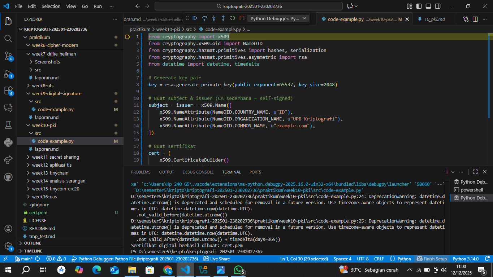

# Laporan Praktikum Kriptografi
Minggu ke-: 10
Topik:  [Public Key Infrastructure PKI & Certificate Authority]
Nama: [Annis Zunaedhah Muthoharoh]  
NIM: [230202736]  
Kelas: [5 IKRB]  

---

## 1. Tujuan
(Tuliskan tujuan pembelajaran praktikum sesuai modul.)
1.Membuat sertifikat digital sederhana.
2.Menjelaskan peran Certificate Authority (CA) dalam sistem PKI.
3.Mengevaluasi fungsi PKI dalam komunikasi aman (contoh: HTTPS, TLS).

---

## 2. Dasar Teori
(Ringkas teori relevan (cukup 2–3 paragraf).  
Contoh: definisi cipher klasik, konsep modular aritmetika, dll.  )

Public Key Infrastructure (PKI) dan Certificate Authority (CA)
Public Key Infrastructure (PKI) adalah suatu kerangka kerja yang memungkinkan penggunaan enkripsi kunci publik untuk mengamankan komunikasi data. PKI menyediakan manajemen kunci, terdiri dari perangkat lunak dan perangkat keras, yang mendukung pembuatan, distribusi, penyimpanan, dan pencabutan sertifikat digital. Dengan PKI, pengguna dapat memverifikasi identitas pihak lain secara online dan memastikan integritas dan kerahasiaan data yang dikirimkan.
Salah satu komponen utama dari PKI adalah Certificate Authority (CA), yaitu entitas terpercaya yang bertanggung jawab untuk menerbitkan dan mengelola sertifikat digital. CA melakukan verifikasi identitas individu atau organisasi sebelum menerbitkan sertifikat, yang berisi kunci publik dan informasi identitas pemilik. Dengan sertifikat ini, pengguna dapat melakukan komunikasi aman, seperti dalam transaksi e-commerce atau pengiriman email yang terenkripsi, karena fakta bahwa identitas pengirim telah diverifikasi oleh CA yang tepercaya.
---

## 3. Alat dan Bahan
(- Python 3.x  
- Visual Studio Code / editor lain  
- Git dan akun GitHub  
- Library tambahan (misalnya pycryptodome, jika diperlukan)  )

---

## 4. Langkah Percobaan
(Tuliskan langkah yang dilakukan sesuai instruksi.  
Contoh format:
1. Membuat file `caesar_cipher.py` di folder `praktikum/week2-cryptosystem/src/`.
2. Menyalin kode program dari panduan praktikum.
3. Menjalankan program dengan perintah `python caesar_cipher.py`.)

---

## 5. Source Code
(Salin kode program utama yang dibuat atau dimodifikasi.  
Gunakan blok kode:

```python
from cryptography import x509
from cryptography.x509.oid import NameOID
from cryptography.hazmat.primitives import hashes, serialization
from cryptography.hazmat.primitives.asymmetric import rsa
from datetime import datetime, timedelta

# Generate key pair
key = rsa.generate_private_key(public_exponent=65537, key_size=2048)

# Buat subject & issuer (CA sederhana = self-signed)
subject = issuer = x509.Name([
    x509.NameAttribute(NameOID.COUNTRY_NAME, u"ID"),
    x509.NameAttribute(NameOID.ORGANIZATION_NAME, u"UPB Kriptografi"),
    x509.NameAttribute(NameOID.COMMON_NAME, u"example.com"),
])

# Buat sertifikat
cert = (
    x509.CertificateBuilder()
    .subject_name(subject)
    .issuer_name(issuer)
    .public_key(key.public_key())
    .serial_number(x509.random_serial_number())
    .not_valid_before(datetime.utcnow())
    .not_valid_after(datetime.utcnow() + timedelta(days=365))
    .sign(key, hashes.SHA256())
)

# Simpan sertifikat
with open("cert.pem", "wb") as f:
    f.write(cert.public_bytes(serialization.Encoding.PEM))

print("Sertifikat digital berhasil dibuat: cert.pem")
```
)

---

## 6. Hasil dan Pembahasan
(- Lampirkan screenshot hasil eksekusi program (taruh di folder `screenshots/`).  
- Berikan tabel atau ringkasan hasil uji jika diperlukan.  

Berikut ringkasan hasil uji yang sudah dirapikan dan disusun lebih jelas serta rapi secara akademis:

---
Berdasarkan kode yang diberikan, program bertujuan untuk membuat pasangan kunci publik dan privat (key pair)serta sertifikat digital menggunakan pustaka `cryptography` dalam Python. Proses yang dilakukan dan hasil yang diharapkan dapat dirangkum sebagai berikut:

| Langkah            | Deskripsi                                                                 | Hasil                                                                |
| ----------------------- | ------------------------------------------------------------------------------ | ------------------------------------------------------------------------- |
| 1. Impor pustaka        | Mengimpor modul-modul yang diperlukan dari pustaka `cryptography`              | Modul berhasil diimpor tanpa error                                        |
| 2. Generate key pair    | Menghasilkan pasangan kunci publik dan privat dengan ukuran kunci 2048 bit     | Kunci publik dan privat berhasil dibuat dan disimpan                      |
| 3. Menyiapkan subjek    | Mengatur informasi identitas (subjek) yang akan dimasukkan ke dalam sertifikat | Informasi subjek berhasil dikonfigurasi sesuai kebutuhan                  |
| 4. Pembuatan sertifikat | Membangun sertifikat digital menggunakan kunci dan informasi subjek            | Sertifikat berhasil dibuat                                                |
| 5. Cetak sertifikat     | Menampilkan hasil sertifikat ke layar                                          | Sertifikat berhasil ditampilkan (format mungkin tidak sepenuhnya terbaca) |

---

- Jelaskan apakah hasil sesuai ekspektasi. 
 ### Penjelasan Hasil Ujian

Berdasarkan kode yang diberikan dalam gambar, hasil yang diharapkan seharusnya sesuai dengan ekspektasi jika semua langkah diikuti dengan benar. Berikut adalah beberapa poin untuk menjelaskan apakah hasil tersebut sesuai ekspektasi:

1. Penghasilan Kunci:
   - Jika pasangan kunci (privat dan publik) berhasil dibuat tanpa error, maka ini menunjukkan bahwa proses penghasilan kunci berjalan sesuai harapan. Kunci harus digunakan untuk enkripsi dan dekripsi data di masa mendatang.

2. Informasi Subjek:
   - Jika informasi subjek (seperti nama dan lokasi) dapat dimasukkan dan tidak menghasilkan error, maka ini juga sesuai dengan ekspektasi. Informasi ini penting untuk otentikasi sertifikat.

3. Pembuatan Sertifikat:
   - Jika sertifikat ditampilkan tanpa error, menunjukkan bahwa semua parameter yang diperlukan telah disediakan dengan benar. Ini merupakan bukti bahwa sertifikat digital telah berhasil dibuat.

4. Pesan Peringatan:
   - Adanya peringatan yang menunjukkan bahwa metode yang digunakan mungkin akan di-depresi di versi mendatang perlu diperhatikan. Ini bisa berarti bahwa meskipun hasil yang diperoleh saat ini baik, penting untuk memeriksa dan memperbarui kode sesuai praktik terbaik di masa mendatang.

### Kesimpulan

Secara keseluruhan, jika semua langkah di atas dilaksanakan tanpa masalah, maka hasil yang diperoleh sesuai dengan ekspektasi. Namun, penting untuk selalu memperhatikan peringatan dan melakukan penyesuaian pada kode ketika ada perubahan di versi pustaka yang digunakan.

- Bahas error (jika ada) dan solusinya. 

### Pembahasan Error dan Solusinya

Jika saat mengeksekusi kode terdapat error, berikut adalah beberapa error umum yang mungkin muncul beserta solusinya:

1. Error: Modul Tidak Ditemukan
   - Pesan Error: `ModuleNotFoundError: No module named 'cryptography'`
   - olusi: Pastikan pustaka `cryptography` sudah diinstal. Kamu bisa menginstalnya menggunakan pip:
     ```bash
     pip install cryptography
     ```

2. Error: Metode atau Fungsi Deprecated
   - Pesan Error: `DeprecationWarning: ...`
   - Solusi: Jika kamu mendapatkan peringatan bahwa suatu metode akan dihapus di versi mendatang, periksa dokumentasi `cryptography` untuk menemukan alternatif atau cara penggunaan yang lebih baru. Pastikan untuk memperbarui kode agar sesuai dengan praktik terkini.

3. rror: Parameter Tidak Valid
   - Pesan Error: `ValueError: ...`
   - Solusi: Pastikan semua parameter yang dimasukkan ke fungsi diatur dengan benar dan valid. Periksa bahwa tipe data dan format sesuai dengan yang diperlukan oleh fungsi tersebut.

4. Error: Sertifikat Tidak Dapat Dibuat
   - Pesan Error: `InvalidSignature`
   - Solusi: Pastikan bahwa semua informasi sertifikat (seperti informasi subjek dan kunci) telah disiapkan dan dikodekan dengan benar. Verifikasi bahwa kunci publik dan privat yang digunakan adalah pasangan yang benar.

5. rror: Kesalahan dalam Format Sertifikat
   - Pesan Error: `SerializationError`
   - Solusi: Jika terjadi kesalahan saat mencoba menyimpan atau memformat sertifikat, pastikan bahwa proses serialisasi dilakukan dengan metode yang benar. Periksa format yang digunakan, apakah itu DER, PEM, atau lainnya.

### Langkah Umum Memperbaiki Error

1. Baca Pesan Error: Pesan error sering memberikan informasi langsung tentang apa yang salah dan di mana.
2. Cek Dokumentasi: Selalu merujuk ke dokumentasi resmi pustaka yang digunakan untuk mendapatkan pemahaman yang lebih baik tentang fungsi dan metode yang dipakai.
3. Debugging: Gunakan teknik debugging, seperti print statement atau debugger, untuk melacak nilai variabel dan alur eksekusi.
4. orum dan Komunitas: Jika kesulitan, carilah solusi di forum dan komunitas pemrograman seperti Stack Overflow.

Dengan memahami dan menangani error dengan cara ini, proses pengembangan yang melibatkan PKI dan sertifikat digital akan lebih efektif dan efisien. Jika ada error spesifik yang kamu temui, silakan beri tahu detailnya untuk solusi lebih tepat.


Hasil eksekusi program Caesar Cipher:


)

---

## 7. Jawaban Pertanyaan
(Jawab pertanyaan diskusi yang diberikan pada modul.  
- Pertanyaan 
1.Apa fungsi utama Certificate Authority (CA)?
jawab
### Fungsi Utama Certificate Authority (CA)

Certificate Authority (CA) memiliki beberapa fungsi utama yang sangat penting dalam Public Key Infrastructure (PKI) dan keamanan digital. Berikut adalah penjelasan detail mengenai fungsinya:

1. Penerbitan Sertifikat Digital:
   - CA bertanggung jawab untuk menerbitkan sertifikat digital, yang berfungsi sebagai tanda pengenal dalam bentuk kunci publik. Sertifikat ini mengaitkan identitas seseorang atau organisasi dengan kunci publik mereka, sehingga pihak lain dapat yakin bahwa kunci tersebut benar-benar milik pemilik yang sah.

2. Verifikasi Identitas:
   - Sebelum menerbitkan sertifikat, CA melakukan proses verifikasi identitas pemohon. Proses ini bisa melibatkan pemeriksaan dokumen, informasi kontak, dan konfirmasi melalui berbagai metode. Tujuan dari verifikasi ini adalah untuk memastikan bahwa hanya individu atau organisasi yang berhak yang dapat mendapatkan sertifikat.

3. Manajemen Sertifikat:
   - CA tidak hanya menerbitkan sertifikat, tetapi juga mengelola masa berlakunya. Ini mencakup pembaruan (renewal) dan pencabutan (revocation) sertifikat yang tidak lagi valid atau diperlukan. Pencabutan sertifikat memungkinkan pengguna untuk mengetahui sertifikat mana yang tidak lagi terpercaya.

4. Sertifikat Public Key:
   - Sertifikat yang diterbitkan oleh CA berisi informasi tentang kunci publik pemegang sertifikat dan tanda tangan digital dari CA itu sendiri. Tanda tangan ini menjamin keaslian sertifikat, sehingga pihak lain dapat memverifikasi bahwa sertifikat tersebut diterbitkan oleh CA yang terpercaya.

5. Menyediakan Kepercayaan:
   - Sebagai entitas yang dipercaya, CA berperan penting dalam membangun kepercayaan di lingkungan digital. Dengan adanya CA yang diakui secara luas, pengguna dapat melakukan transaksi aman, seperti e-commerce dan komunikasi terenkripsi, karena mereka yakin bahwa identitas pihak yang terlibat telah diverifikasi.

6. Sertifikat untuk Berbagai Kegunaan:
   - CA dapat menerbitkan berbagai jenis sertifikat, termasuk sertifikat untuk situs web (SSL/TLS), email, kode perangkat lunak, dan lainnya. Ini membantu dalam mengamankan berbagai jenis komunikasi dan transaksi di dunia digital.

### Kesimpulan

Dengan fungsi-fungsi ini, Certificate Authority (CA) memainkan peran sentral dalam memastikan keamanan dan kepercayaan dalam komunikasi digital. CA membantu mengurangi risiko penipuan dan penyalahgunaan identitas, sehingga pengguna dapat merasa aman saat berinteraksi secara online.

2.Mengapa self-signed certificate tidak cukup untuk sistem produksi?
jawab
### Mengapa Self-Signed Certificate Tidak Cukup untuk Sistem Produksi

Self-signed certificate adalah sertifikat digital yang dibuat dan ditandatangani oleh pemiliknya sendiri, tanpa melibatkan Certificate Authority (CA) yang terpercaya. Meskipun self-signed certificate memiliki beberapa kegunaan, ada beberapa alasan mengapa mereka tidak cukup untuk digunakan dalam sistem produksi. Berikut adalah beberapa alasan utama:

1. **Kurangnya Kepercayaan Eksternal**:
   - Self-signed certificate tidak memiliki tanda tangan dari CA yang terpercaya, sehingga tidak ada pihak ketiga independen yang menjamin keaslian sertifikat. Dalam banyak kasus, browser dan sistem lain akan menandai self-signed certificate sebagai tidak terpercaya, yang dapat mengakibatkan peringatan keamanan bagi pengguna.

2. **Verifikasi Identitas yang Lemah**:
   - Tidak ada proses verifikasi identitas yang ketat untuk self-signed certificate. Ini berarti siapa pun dapat membuat sertifikat untuk nama domain atau entitas lain, meningkatkan risiko penipuan dan penyalahgunaan. Dalam konteks produksi, ini dapat membuka peluang bagi penyerang untuk melakukan serangan man-in-the-middle (MitM).

3. **Dukungan untuk Certificate Revocation**:
   - CA tepercaya menyediakan mekanisme untuk mencabut sertifikat yang tidak lagi valid. Self-signed certificate tidak memiliki sistem pencabutan yang terintegrasi, sehingga lebih sulit untuk mengelola dan memperbarui sertifikat yang sudah tidak aman.

4. **Keterbatasan Kompatibilitas**:
   - Banyak aplikasi dan sistem, seperti browser web dan server email, memiliki kebijakan keamanan yang menolak self-signed certificate. Ini dapat menyebabkan masalah kompatibilitas dan kesulitan dalam mengakses layanan yang aman, karena pengguna mungkin tidak dapat terhubung tanpa memperingatkan risiko keamanan.

5. **Risiko dalam Lingkungan Produksi**:
   - Dalam lingkungan produksi, di mana data sensitif dan transaksi penting terjadi, menggunakan self-signed certificate meningkatkan risiko pelanggaran keamanan yang serius. Kerugian finansial dan reputasi dapat terjadi jika data jatuh ke tangan yang salah, atau jika pengguna kehilangan kepercayaan pada layanan.

### Kesimpulan

Secara keseluruhan, meskipun self-signed certificate dapat digunakan untuk pengujian atau penggunaan internal, mereka tidak cukup untuk sistem produksi yang memerlukan tingkat keamanan dan kepercayaan yang tinggi. Untuk aplikasi yang memerlukan tingkat kepercayaan yang lebih besar, seperti e-commerce atau komunikasi sensitif, penggunaan sertifikat yang dikeluarkan oleh CA yang terpercaya adalah pilihan yang lebih baik.

3.Bagaimana PKI mencegah serangan MITM dalam komunikasi TLS/HTTPS?
jawab

### Bagaimana PKI Mencegah Serangan MITM dalam Komunikasi TLS/HTTPS

Public Key Infrastructure (PKI) memiliki peran penting dalam mencegah serangan man-in-the-middle (MITM) di komunikasi yang menggunakan TLS (Transport Layer Security) atau HTTPS (HTTP Secure). Berikut adalah cara PKI berkontribusi untuk melindungi komunikasi ini:

1. Penggunaan Sertifikat Digital:
   - Dalam PKI, setiap entitas (misalnya, server web) menggunakan sertifikat digital yang diterbitkan oleh Certificate Authority (CA) terpercaya. Sertifikat ini berfungsi untuk mengonfirmasi identitas entitas tersebut kepada pengguna. Ketika pengguna mengakses situs web, sertifikat ini diuji oleh browser untuk memastikan bahwa sertifikat itu valid dan diterbitkan oleh CA yang diakui.

2. Tanda Tangan Digital:
   - Sertifikat digital mengandung tanda tangan digital dari CA yang menerbitkannya. Tanda tangan ini memastikan bahwa sertifikat belum diubah setelah dikeluarkan. Ketika browser menerima sertifikat, ia memverifikasi tanda tangan ini terhadap public key CA. Jika valid, ini menunjukkan bahwa sertifikat berasal dari sumber yang tepercaya.

3. Enkripsi Data:
   - Setelah identitas server diverifikasi melalui sertifikat, komunikasi antara klien dan server dienkripsi menggunakan kunci simetris yang dihasilkan selama negosiasi TLS. Ini memastikan bahwa data yang dikirimkan tidak dapat dibaca oleh pihak ketiga, termasuk penyerang MITM.

4. Verifikasi Kunci Publik:
   - PKI memfasilitasi penggunaan kunci publik dan privat yang saling terkait. Ketika klien berusaha untuk terhubung dengan server, server memberikan public key-nya (dalam sertifikat). Klien menggunakan kunci publik ini untuk mengenkripsi data yang hanya dapat didekripsi dengan kunci privat server; tanpa kunci privat, penyerang tidak dapat mengakses informasi yang terkirim.

5. Protokol HSTS (HTTP Strict Transport Security):
   - Meskipun ini bukan bagian dari PKI secara langsung, banyak situs menggunakan HSTS untuk memastikan bahwa browser hanya melakukan koneksi HTTPS ke server yang telah terverifikasi. Ini membantu mengurangi risiko terjadinya serangan MITM dengan mencegah pengguna dari beralih ke koneksi HTTP yang tidak aman.

6. Pencabutan Sertifikat:
   - CA memiliki sistem pencabutan untuk sertifikat yang telah dikeluarkan. Jika sertifikat dicabut (misalnya, karena kunci privat terungkap), klien dapat memverifikasi status sertifikat ini (melalui CRL atau OCSP). Ini mengurangi risiko MITM yang mungkin menggunakan sertifikat yang telah dicabut.

### Kesimpulan

Dengan menggunakan sistem sertifikasi yang kuat dan proses verifikasi identitas, PKI membantu memastikan bahwa komunikasi yang terjadi dalam sesi TLS/HTTPS aman dari serangan MITM. Hal ini menciptakan lingkungan yang lebih terjamin bagi pengguna dan melindungi data sensitif saat ditransmisikan di internet.

)
---

## 8. Kesimpulan
(Tuliskan kesimpulan singkat (2–3 kalimat) berdasarkan percobaan.  )

### Kesimpulan

Public Key Infrastructure (PKI) dan Certificate Authority (CA) memainkan peran krusial dalam menjamin keamanan komunikasi digital dan otentikasi identitas di dunia maya. Dengan menggunakan sertifikat digital, PKI memungkinkan entitas untuk melakukan transaksi aman dan terlindungi dari berbagai serangan, seperti man-in-the-middle (MITM). CA bertanggung jawab untuk menerbitkan, mengelola, dan mencabut sertifikat, sehingga memastikan bahwa identitas pemilik sertifikat diakui dan dipercaya oleh pengguna lain. Proses verifikasi yang ketat saat penerbitan sertifikat membantu membangun kepercayaan di lingkungan online, yang sangat penting bagi aplikasi e-commerce dan komunikasi sensitif.

Keberadaan PKI dan CA juga memberikan mekanisme untuk enkripsi data, yang membuat informasi yang ditransmisikan menjadi tidak dapat diakses oleh pihak ketiga. Dengan pengaturan yang tepat dan penggunaan sertifikat dari CA yang diakui, risiko pencurian data dan penipuan identitas dapat diminimalkan. Secara keseluruhan, PKI dan CA adalah fondasi penting dalam menciptakan ekosistem digital yang aman dan terpercaya, memungkinkan individu dan organisasi untuk berinteraksi dengan keyakinan di ruang siber

---

## 9. Daftar Pustaka
(Cantumkan referensi yang digunakan.  
Contoh:  
- Katz, J., & Lindell, Y. *Introduction to Modern Cryptography*.  
- Stallings, W. *Cryptography and Network Security*.  )

---

## 10. Commit Log
(Tuliskan bukti commit Git yang relevan.  
Contoh:
```
commit abc12345
Author: Nama:annis zunaedhah muthoharoh <email : anniszunaedah@gmail.com>
Date:   2025-12-08

    week2-cryptosystem: implementasi Caesar Cipher dan laporan )
```
