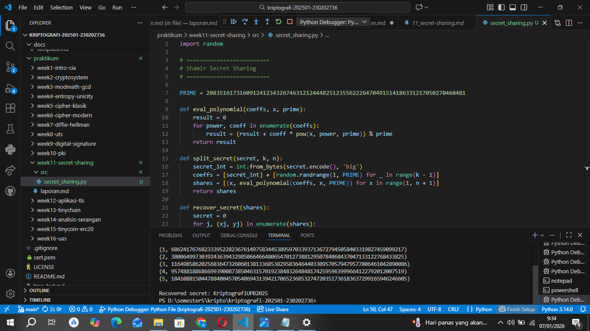

# Laporan Praktikum Kriptografi
Minggu ke-: 11
Topik: [Secret Sharing Shamir’s Secret Sharing]  
Nama: [annis zaedhah muthoharoh]  
NIM: [230202736]  
Kelas: [5 IKRB]  

---

## 1. Tujuan
(Tuliskan tujuan pembelajaran praktikum sesuai modul.)
1.Menjelaskan konsep Shamir Secret Sharing (SSS).
2.Melakukan simulasi pembagian rahasia ke beberapa pihak menggunakan skema SSS.
3.Menganalisis keamanan skema distribusi rahasia.

---

## 2. Dasar Teori
(Ringkas teori relevan (cukup 2–3 paragraf).  
Contoh: definisi cipher klasik, konsep modular aritmetika, dll.  )

### Shamir’s Secret Sharing

Shamir’s Secret Sharing adalah suatu metode kriptografi yang digunakan untuk membagi rahasia menjadi beberapa bagian (shares) sedemikian rupa sehingga hanya sejumlah bagian tertentu (threshold) yang diperlukan untuk merekonstruksi rahasia tersebut. Metode ini berdasar pada teori polinomial, di mana rahasia dianggap sebagai nilai dari polinomial di suatu titik, dan bagian-bagian tersebut adalah nilai dari polinomial di titik-titik lain. Dengan menggunakan polinomial berderajat \( t-1 \), di mana \( t \) adalah jumlah minimum bagian yang diperlukan untuk membangun kembali rahasia, Shamir dapat menjamin bahwa setiap sekelompok bagian yang kurang dari \( t \) tidak mengungkapkan informasi tentang rahasia yang asli.

Proses pembagian ini melibatkan pemilihan koefisien dari polinomial secara acak dan menggunakan rahasia sebagai nilai konstan polinomial. Para peserta kemudian diberikan nilai-nilai polinomial yang berbeda berdasarkan titik yang sudah ditentukan. Untuk merekonstruksi rahasia, sekurang-kurangnya \( t \) peserta harus menjalin kerjasama untuk mengumpulkan bagian mereka dan menggunakan interpolasi polinomial (seperti metode Lagrange) untuk menemukan nilai rahasia pada titik yang telah ditentukan. Metode ini efisien dan memberikan tingkat keamanan yang tinggi, memungkinkan distribusi rahasia secara aman dalam sistem distribusi tanpa mengungkapkan informasi lebih dari yang diperlukan.

---

## 3. Alat dan Bahan
(- Python 3.x  
- Visual Studio Code / editor lain  
- Git dan akun GitHub  
- Library tambahan (misalnya pycryptodome, jika diperlukan)  )

---

## 4. Langkah Percobaan
(Tuliskan langkah yang dilakukan sesuai instruksi.  
Contoh format:
1. Membuat file `caesar_cipher.py` di folder `praktikum/week2-cryptosystem/src/`.
2. Menyalin kode program dari panduan praktikum.
3. Menjalankan program dengan perintah `python caesar_cipher.py`.)

---

## 5. Source Code
(Salin kode program utama yang dibuat atau dimodifikasi.  
Gunakan blok kode:

```python
# contoh potongan kode
def encrypt(text, key):
    return ...
```
)

---

## 6. Hasil dan Pembahasan
(- Lampirkan screenshot hasil eksekusi program (taruh di folder `screenshots/`).  
- Berikan tabel atau ringkasan hasil uji jika diperlukan.  
- Jelaskan apakah hasil sesuai ekspektasi.  
- Bahas error (jika ada) dan solusinya. 

Hasil eksekusi program Caesar Cipher:




)

---

## 7. Jawaban Pertanyaan
(Jawab pertanyaan diskusi yang diberikan pada modul.
  
- Pertanyaan 
1.Apa keuntungan utama Shamir Secret Sharing dibanding membagikan salinan kunci secara langsung?
jawab
### Keuntungan Utama Shamir’s Secret Sharing

1. Keamanan yang Lebih Baik:
   - Shamir’s Secret Sharing menyediakan keamanan tambahan karena rahasia hanya dapat direkonstruksi jika jumlah minimum bagian tertentu (treshold) digabungkan. Jika kunci dibagikan secara langsung dan salah satu salinan kunci jatuh ke tangan yang tidak sah, keamanan seluruh sistem akan terganggu. Dengan Shamir, meskipun beberapa bagian hilang atau dicuri, selama jumlah minimum yang diperlukan tetap aman, rahasia tetap terjaga.

2. Pencegahan Kecurangan Internal:
   - Dengan membagi rahasia menjadi beberapa bagian, Shamir’s Secret Sharing meminimalkan risiko dari insider threat. Misalnya, jika satu individu tidak dapat mengakses bagian tertentu dan tidak tahu informasi lain, ia tidak dapat mengungkapkan rahasia tersebut sendiri. Ini menciptakan sistem yang lebih kolaboratif, yang memungkinkan distribusi tanggung jawab tanpa memberikan kontrol total kepada satu individu.

3. **Fleksibilitas dan Manajemen**:
   - Menggunakan metode ini, organisasi dapat mengatur dan mengelola akses ke rahasia dengan lebih fleksibel. Misalnya, jika hanya diperlukan dua dari lima orang untuk mengakses kunci, maka sistem mudah diatur untuk memperbarui keanggotaan tanpa mengubah rahasia itu sendiri. Banyaknya kombinasi peserta yang bisa dipilih untuk membangun kembali rahasia memungkinkan adaptasi terhadap perubahan kebutuhan organisasi.

### Kesimpulan

Dengan sejumlah keuntungan di atas, Shamir’s Secret Sharing menjadi metode yang lebih kuat dan fleksibel untuk menjaga keamanan rahasia, khususnya dalam konteks di mana perlindungan terhadap akses tidak sah atau kehilangan bagian dari rahasia sangat penting.

2.Apa peran threshold (k) dalam keamanan secret sharing?
jawab
### Peran Threshold (k) dalam Keamanan Secret Sharing

Threshold (k) dalam Shamir’s Secret Sharing memainkan peranan penting dalam menentukan keamanan dan integritas sistem berbagi rahasia. Berikut adalah beberapa aspek kunci yang menjelaskan perannya:

1. Minimalitas Keterlibatan:
   - Threshold (k) menentukan jumlah minimum bagian yang diperlukan untuk merekonstruksi rahasia. Dengan menjadikan \( k \) lebih besar dari 1, sistem memungkinkan pembagian tanggung jawab di antara beberapa peserta. Ini mencegah individu tunggal atau sekelompok kecil pemegang bagian dari memiliki kekuasaan absolut untuk mengakses rahasia, yang mengurangi risiko penyalahgunaan atau pencurian.

2. Keamanan Melawan Kombinasi:
   - Dengan menetapkan threshold yang lebih tinggi, Shamir's Secret Sharing meningkatkan keamanan dengan memastikan bahwa tidak semua pemegang bagian dapat secara individual atau kolusif mengakses rahasia. Sebagai contoh, jika threshold adalah 3 dalam sistem dengan 5 bagian, maka meskipun 2 bagian dicuri, rahasia tetap aman, karena 2 bagian yang tersisa tidak cukup untuk mengungkap informasi.

3. Meningkatkan Resiliensi:
   - Threshold (k) memungkinkan desain sistem yang fleksibel dan resiliensi terhadap kehilangan atau kerusakan sebagian dari bagian. Meskipun beberapa bagian hilang, asalkan jumlah minimum yang diperlukan tetap utuh, rahasia masih dapat dipulihkan. Ini amat penting dalam penggunaan nyata, di mana kehilangan hak akses atau penyimpanan dapat terjadi.

### Kesimpulan

Dengan mendefinisikan threshold (k) secara hati-hati, sistem secret sharing dapat dirancang untuk mencapai tingkat keamanan yang diinginkan sambil mempertahankan fleksibilitas operasional. Ini memberikan dasar yang kuat untuk sistem berbagi rahasia yang efisien dan aman dalam berbagai aplikasi.

3.Berikan satu contoh skenario nyata di mana SSS sangat bermanfaat?

jawab
### Contoh Skenario Nyata: Keamanan Data Perbankan

Skenario: Di dalam sebuah lembaga keuangan, khususnya bank, sangat penting untuk melindungi data sensitif pelanggan dan kunci enkripsi yang digunakan untuk mengakses informasi tersebut. Untuk mengurangi risiko pencurian data dan penyalahgunaan kekuasaan oleh karyawan, bank memutuskan untuk menggunakan Shamir’s Secret Sharing (SSS) dalam mengelola kunci enkripsi.

Implementasi:
- Bank membagi kunci enkripsi utama menjadi lima bagian menggunakan metode SSS, dengan threshold (k) yang ditetapkan pada tiga. Ini berarti setidaknya tiga dari lima bagian diperlukan untuk merekonstruksi kunci.
- Setiap bagian diberikan kepada pemegang yang berbeda, termasuk manajer IT, kepala keamanan, dan dua anggota tim audit. Dengan cara ini, tidak ada satu individu pun yang memiliki akses penuh ke kunci enkripsi.

Keuntungan:
1. Peningkatan Keamanan: Jika salah satu bagian dicuri, penyerang tidak dapat mengakses kunci atau data tanpa dua bagian lainnya.
2. Pencegahan Penyalahgunaan: Tidak ada seorang pun yang dapat mengakses data sensitif sendirian, sehingga mencegah insider threat.
3. Fleksibilitas: Jika salah satu pemegang bagian keluar dari organisasi, bank dapat dengan mudah mengganti bagian tersebut tanpa harus mengubah seluruh kunci enkripsi, asalkan jumlah pemegang yang tersisa mencukupi untuk memenuhi threshold (k).

### Kesimpulan

Implementasi Shamir’s Secret Sharing dalam lembaga keuangan seperti bank tidak hanya meningkatkan keamanan data, tetapi juga menciptakan sistem yang lebih robust dan responsif terhadap risiko yang dapat muncul, baik dari inside maupun outside threats.

---

## 8. Kesimpulan
(Tuliskan kesimpulan singkat (2–3 kalimat) berdasarkan percobaan.  )

### Kesimpulan

Shamir’s Secret Sharing (SSS) adalah metode kriptografi yang efektif untuk membagi rahasia menjadi beberapa bagian, di mana hanya sejumlah bagian tertentu yang diperlukan untuk merekonstruksi rahasia tersebut. Dengan menggunakan prinsip polinomial, SSS memungkinkan rahasia untuk didistribusikan secara aman di antara peserta, sambil menjaga tingkat keamanan yang tinggi. Keuntungan utama dari SSS terletak pada kemampuannya untuk mencegah akses tidak sah; meskipun beberapa bagian hilang atau dicuri, rahasia tetap aman selama jumlah minimum peserta (threshold) terjaga.

Metode ini sangat relevan dalam berbagai konteks, terutama di bidang yang memerlukan keamanan tinggi, seperti keuangan dan data pribadi. Implementasi SSS tidak hanya menciptakan sistem yang lebih aman, tetapi juga memberikan fleksibilitas dalam manajemen akses, sehingga risiko penyalahgunaan dan insider threat dapat diminimalkan. Dengan begitu, Shamir’s Secret Sharing menjadi alat penting dalam perlindungan data dan pengelolaan rahasia di lingkungan yang berisiko tinggi.

---

## 9. Daftar Pustaka
(Cantumkan referensi yang digunakan.  
Contoh:  
- Katz, J., & Lindell, Y. *Introduction to Modern Cryptography*.  
- Stallings, W. *Cryptography and Network Security*.  )

---

## 10. Commit Log
(Tuliskan bukti commit Git yang relevan.  
Contoh:
```
commit abc12345
Author: Nama:annis zunaedhah muthoharoh <email : anniszunaedah@gmail.com>
Date:   2025-12-08

    week2-cryptosystem: implementasi Caesar Cipher dan laporan )
```
