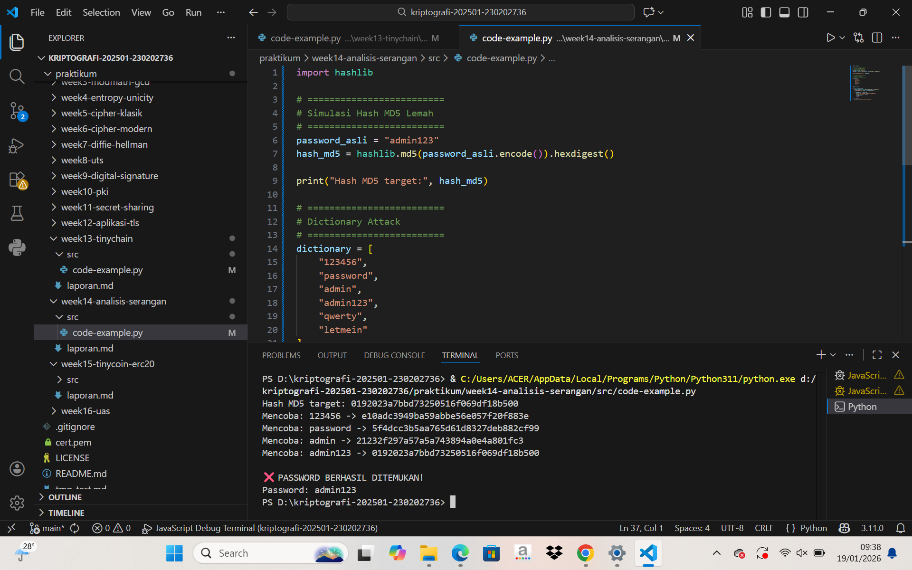

# Laporan Praktikum Kriptografi
Minggu ke-: 14 
Topik: [Analisis Serangan Kriptografi]  
Nama: [Annis Zunaedhah Muthoharoh]  
NIM: [230202736]  
Kelas: [5 IKRB]  

---

## 1. Tujuan
(Tuliskan tujuan pembelajaran praktikum sesuai modul.)
1.Mengidentifikasi jenis serangan pada sistem informasi nyata.
2.Mengevaluasi kelemahan algoritma kriptografi yang digunakan.
3.Memberikan rekomendasi algoritma kriptografi yang sesuai untuk perbaikan keamanan.

---

## 2. Dasar Teori
(Ringkas teori relevan (cukup 2–3 paragraf).  
Contoh: definisi cipher klasik, konsep modular aritmetika, dll.  )

### Analisis Serangan Kriptografi

Analisis serangan kriptografi merupakan metodologi yang digunakan untuk membongkar atau melemahkan keamanan sistem kriptografi. Secara umum, tujuannya adalah untuk mendapatkan akses tidak sah ke informasi yang seharusnya dilindungi. Ada berbagai jenis serangan yang dapat dilakukan, seperti serangan brute force, di mana penyerang mencoba semua kemungkinan kombinasi kunci untuk mendekripsi pesan. Selain itu, ada juga serangan analisis statistik yang mencoba memanfaatkan pola atau kelemahan dalam algoritma enkripsi untuk meretas informasi.

Salah satu contoh penting dalam analisis serangan adalah serangan ciphertext-only, di mana penyerang hanya memiliki akses ke ciphertext (data yang telah dienkripsi) tanpa tahu plaintext (data asli) atau kunci yang digunakan. Dalam serangan ini, penyerang menerapkan analisis matematis untuk mengungkapkan isi pesan. Konsep ini menunjukkan pentingnya memilih algoritma kriptografi yang kuat dan menerapkannya dengan benar, karena kelemahan dalam algoritma dapat dimanfaatkan untuk mengakses informasi sensitif.

Selain itu, serangan kriptografi juga dapat melibatkan teknik manipulasi, seperti serangan chosen plaintext, di mana penyerang memilih pesan tertentu untuk dienkripsi dan kemudian menganalisis hasilnya. Dengan memahami cara kerja algoritma enkripsi dan melakukan analisis yang mendalam, penyerang dapat menemukan celah untuk mengakses data tanpa izin. Oleh karena itu, penting bagi para profesional keamanan informasi untuk terus memperbarui dan memperkuat sistem kriptografi guna melindungi data dari berbagai jenis serangan.

---

## 3. Alat dan Bahan
(- Python 3.x  
- Visual Studio Code / editor lain  
- Git dan akun GitHub  
- Library tambahan (misalnya pycryptodome, jika diperlukan)  )

---

## 4. Langkah Percobaan
(Tuliskan langkah yang dilakukan sesuai instruksi.  
Contoh format:
1. Membuat file `caesar_cipher.py` di folder `praktikum/week2-cryptosystem/src/`.
2. Menyalin kode program dari panduan praktikum.
3. Menjalankan program dengan perintah `python caesar_cipher.py`.)

---

## 5. Source Code
(Salin kode program utama yang dibuat atau dimodifikasi.  
Gunakan blok kode:

```python
import hashlib

# =========================
# Simulasi Hash MD5 Lemah
# =========================
password_asli = "admin123"
hash_md5 = hashlib.md5(password_asli.encode()).hexdigest()

print("Hash MD5 target:", hash_md5)

# =========================
# Dictionary Attack
# =========================
dictionary = [
    "123456",
    "password",
    "admin",
    "admin123",
    "qwerty",
    "letmein"
]

found = False

for word in dictionary:
    hashed_word = hashlib.md5(word.encode()).hexdigest()
    print(f"Mencoba: {word} -> {hashed_word}")

    if hashed_word == hash_md5:
        print("\n❌ PASSWORD BERHASIL DITEMUKAN!")
        print("Password:", word)
        found = True
        break

if not found:
    print("\nPassword tidak ditemukan.")

```
)

---

## 6. Hasil dan Pembahasan
(- Lampirkan screenshot hasil eksekusi program (taruh di folder `screenshots/`).  
- Berikan tabel atau ringkasan hasil uji jika diperlukan.  
- Jelaskan apakah hasil sesuai ekspektasi.  
- Bahas error (jika ada) dan solusinya. 

Hasil eksekusi program Caesar Cipher:


)

---

## 7. Jawaban Pertanyaan
(Jawab pertanyaan diskusi yang diberikan pada modul.  
- Pertanyaan
1. Mengapa banyak sistem lama masih rentan terhadap brute force atau dictionary attack?
jawab
Mengapa Banyak Sistem Lama Masih Rentan terhadap Brute Force atau Dictionary Attack

Banyak sistem lama yang masih rentan terhadap serangan brute force atau dictionary attack karena beberapa alasan utama:

1. Penggunaan Kunci dan Sandi yang Lemah: Sistem-sistem lama sering kali menggunakan kunci yang pendek atau algoritma enkripsi yang tidak cukup kuat. Misalnya, jika sebuah sistem menggunakan kata sandi dengan panjang delapan karakter, ada jutaan kombinasi yang mungkin, tetapi dengan peningkatan daya komputasi, penyerang dapat dengan mudah mencoba semua kemungkinan kombinasi tersebut. Selain itu, penggunaan kata sandi yang umum atau lemah membuatnya rentan terhadap serangan dictionary, di mana penyerang menggunakan daftar kata yang umum digunakan atau kombinasi huruf yang sering ditemui.

2. Kurangnya Pembaruan dan Pemeliharaan: Banyak sistem lama tidak mendapatkan pembaruan atau pemeliharaan yang cukup dari pengembangnya. Tanpa pembaruan, sistem ini tetap menggunakan protokol keamanan yang bisa usang dan tidak memadai untuk menghadapi teknik serangan modern. Dengan tidak diperbaruinya sistem, celah keamanan yang sudah dikenal tetap ada, memudahkan penyerang untuk mengeksploitasinya.

3. Kesadaran Keamanan yang Rendah: Pengguna dan administrator sistem sering kali kurang menyadari pentingnya praktik keamanan yang baik. Banyak orang masih menggunakan kata sandi yang mudah diingat, seperti tanggal lahir atau nama hewan peliharaan, yang membuatnya lebih mudah bagi penyerang untuk menebak atau menemukan dengan teknik brute force. Selain itu, kurangnya edukasi tentang penggunaan autentikasi multi-faktor atau sistem keamanan tambahan juga menambah risiko.

Dengan kombinasi faktor-faktor ini, banyak sistem lama tetap rentan terhadap serangan brute force dan dictionary attack. Oleh karena itu, penting bagi organisasi untuk melakukan audit keamanan secara berkala, memperbarui sistem, dan mengedukasi pengguna tentang praktik keamanan yang baik.
2.Apa bedanya kelemahan algoritma dengan kelemahan implementasi?
jawab
 Perbedaan Kelemahan Algoritma dan Kelemahan Implementasi

1. Kelemahan Algoritma: Kelemahan algoritma merujuk pada cacat atau kekurangan yang ada dalam algoritma kriptografi itu sendiri. Ini mencakup desain algoritma yang tidak memadai, misalnya, algoritma yang memiliki struktur matematis yang lemah sehingga dapat dengan mudah diterobos oleh penyerang. Contohnya adalah algoritma enkripsi yang menggunakan kunci terlalu pendek atau yang sudah teridentifikasi memiliki vektor serangan yang efektif, seperti kelemahan dalam proses pengacakan. Kelemahan ini biasanya bersifat inheren dan mempengaruhi algoritma secara keseluruhan, terlepas dari bagaimana algoritma tersebut diterapkan.

2. Kelemahan Implementasi: Sementara itu, kelemahan implementasi mengacu pada cacat yang muncul akibat cara algoritma kriptografi diterapkan dalam program atau sistem. Ini bisa termasuk kesalahan pemrograman, seperti bug dalam kode, penggunaan parameter yang salah, atau pengelolaan kunci yang tidak aman. Misalnya, jika sebuah sistem menggunakan algoritma kriptografi yang kuat tetapi menyimpan kunci enkripsi dalam format yang mudah diakses, itu menjadi titik lemah. Kelemahan ini bersifat praktis dan tidak selalu menunjukkan masalah pada algoritma itu sendiri, tetapi lebih kepada bagaimana algoritma digunakan di dalam aplikasi.

Secara singkat, kelemahan algoritma berasal dari desain dasar algoritma, sedangkan kelemahan implementasi terkait dengan bagaimana algoritma tersebut diterapkan dalam sistem nyata. Keduanya dapat menjadi risiko keamanan yang signifikan, dan penting untuk memahami perbedaannya untuk menjaga keamanan informasi.
3.Bagaimana organisasi dapat memastikan sistem kriptografi mereka tetap aman di masa depan?
jawab
Cara Organisasi Memastikan Keamanan Sistem Kriptografi di Masa Depan

1. Pembaruan dan Peningkatan Rutin: Organisasi harus secara teratur memperbarui sistem kriptografi mereka dengan algoritma dan protokol terbaru yang diakui aman. Ini termasuk mengikuti perkembangan terbaru dalam penelitian kriptografi dan menerapkan pembaruan saat ada kerentanan yang diketahui. Berinvestasi dalam teknologi yang lebih canggih, seperti penggunaan algoritma kriptografi yang lebih kuat dan standar enkripsi terkini, juga merupakan langkah penting untuk menjaga keamanan.

2. Pelatihan dan Kesadaran Pengguna: Menerapkan pelatihan reguler untuk karyawan tentang praktik keamanan yang baik sangat penting. Karyawan perlu menyadari potensi risiko keamanan, termasuk serangan phishing dan teknik rekayasa sosial yang dapat mengeksploitasi kelemahan dalam penggunaan kriptografi. Dengan meningkatkan kesadaran dan pengetahuan, organisasi dapat mengurangi kemungkinan kesalahan yang diakibatkan oleh faktor manusia.

3. Audit Keamanan dan Pengujian Penetrasi: Melakukan audit keamanan secara berkala dan pengujian penetrasi pada sistem kriptografi dapat membantu organisasi mengidentifikasi dan memperbaiki celah keamanan sebelum dieksploitasi oleh penyerang. Dengan menguji sistem dalam kondisi nyata, organisasi dapat menemukan kelemahan di implementasi serta memastikan bahwa sistem bekerja seperti yang diharapkan.

4. Implementasi Protokol Manajemen Kunci yang Aman: Kunci enkripsi adalah komponen krusial dalam sistem kriptografi. Oleh karena itu, organisasi harus mengimplementasikan praktik yang aman dalam pengelolaan kunci, termasuk penggunaan penyimpanan yang aman, rotasi kunci secara berkala, serta autentikasi multi-faktor untuk akses ke kunci tersebut.

Dengan langkah-langkah ini, organisasi dapat meningkatkan daya tahan sistem kriptografi mereka dan menjaga keamanan data di masa depan. Keamanan kriptografi bukanlah suatu tujuan akhir, melainkan proses berkelanjutan yang memerlukan perhatian dan penyesuaian seiring berkembangnya teknologi dan ancaman baru.

)

---

## 8. Kesimpulan
(Tuliskan kesimpulan singkat (2–3 kalimat) berdasarkan percobaan.  )

### Kesimpulan Analisis Serangan Kriptografi

Analisis serangan kriptografi merupakan langkah penting dalam melindungi sistem informasi dari berbagai ancaman yang terus berkembang. Dengan memahami berbagai metode serangan, seperti brute force, di mana penyerang mencoba semua kemungkinan kombinasi untuk meretas sistem, dan dictionary attack, yang memanfaatkan daftar kata atau kombinasi umum, organisasi dapat lebih siap terhadap risiko yang ada. Mengidentifikasi karakteristik setiap jenis serangan memungkinkan pengembangan strategi pertahanan yang lebih efektif, sehingga data sensitif yang disimpan dalam sistem kriptografi tetap aman dari akses ilegal.

Selain itu, perhatian terhadap kelemahan dalam algoritma dan implementasi adalah aspek krusial yang tidak boleh diabaikan. Kelemahan algoritma sering kali bersumber dari desain yang kurang kuat, seperti penggunaan kunci yang pendek atau algoritma yang tidak lagi dianggap aman. Di sisi lain, kelemahan implementasi biasanya berasal dari kesalahan dalam pengkodean atau pengelolaan kunci yang kurang baik, seperti penyimpanan kunci dalam format yang mudah diakses. Menyelesaikan kedua masalah tersebut melibatkan pemilihan algoritma yang lebih kuat dan penerapan praktik yang baik dalam pengelolaan kunci, memastikan bahwa celah yang ada ditutup dan sistem berfungsi dengan optimal.

Akhirnya, menjaga sistem kriptografi agar tetap aman di masa depan memerlukan komitmen yang berkelanjutan dari seluruh organisasi. Proses ini mencakup pembaruan rutin untuk menerapkan algoritma dan protokol terbaru, serta memberikan pelatihan kepada karyawan tentang kesadaran keamanan dan praktik terbaik dalam penggunaan sistem. Melakukan audit keamanan secara berkala dan pengujian penetrasi juga penting untuk mengidentifikasi dan mengatasi potensi kelemahan sebelum dapat dieksploitasi oleh penyerang. Dengan pendekatan proaktif ini, organisasi dapat membangun fondasi yang kuat untuk melindungi data mereka dari serangan yang semakin kompleks dan beragam.

---

## 9. Daftar Pustaka
(Cantumkan referensi yang digunakan.  
Contoh:  
- Katz, J., & Lindell, Y. *Introduction to Modern Cryptography*.  
- Stallings, W. *Cryptography and Network Security*.  )

---

## 10. Commit Log
(Tuliskan bukti commit Git yang relevan.  
Contoh:
```
commit abc12345
Author: Nama:annis zunaedhah muthoharoh <email : anniszunaedah@gmail.com>
Date:   2025-12-08

    week2-cryptosystem: implementasi Caesar Cipher dan laporan )
```
