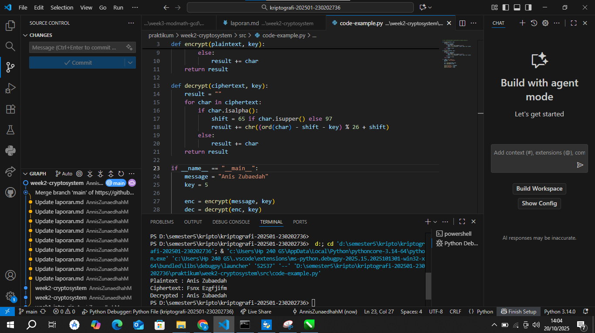
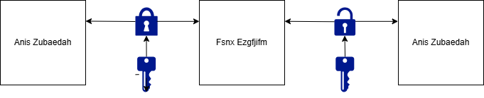

# Laporan Praktikum Kriptografi
Minggu ke-: 02
Topik: [Cryptosystem (Komponen, Enkripsi & Dekripsi, Simetris & Asimetris)]  
Nama: [annis zunaedhah muthoharoh ]  
NIM: [230202736]  
Kelas: [5 IKRB ]  

---

## 1. Tujuan
(Tuliskan tujuan pembelajaran praktikum sesuai modul.)
1.Mengidentifikasi komponen dasar kriptosistem (plaintext, ciphertext, kunci, algoritma).
2.Menggambarkan proses enkripsi dan dekripsi sederhana.
3.Mengklasifikasikan jenis kriptosistem (simetris dan asimetris).

---

## 2. Dasar Teori
(Ringkas teori relevan (cukup 2–3 paragraf).  
Contoh: definisi cipher klasik, konsep modular aritmetika, dll.  )

Ringkasan

Kriptosistem adalah sistem untuk mengamankan informasi agar tidak bisa dibaca atau disalahgunakan oleh pihak yang tidak berhak. Bayangkan seperti mengunci pesan dalam kotak yang hanya bisa dibuka dengan kunci khusus. Berikut adalah komponen utama yang membuat kriptosistem bekerja:

1. Plaintext (Pesan Asli)
   
Ini adalah informasi atau pesan yang ingin kamu lindungi. Misalnya, pesan "Aku mau ke pasar" atau dokumen penting seperti data bank. Plaintext adalah data dalam bentuk aslinya, yang masih bisa dibaca dan dimengerti sebelum diacak.

2.Ciphertext (Pesan Terenkripsi)
Ini adalah versi pesan yang sudah diacak sehingga tidak bisa dibaca tanpa kunci. Misalnya, "Aku mau ke pasar" bisa berubah jadi kode acak seperti "Kj2p9q" setelah dienkripsi. Ciphertext ini seperti pesan yang dikunci rapat, hanya orang dengan kunci yang tepat yang bisa membukanya.

3.Kunci (Key)
Kunci adalah rahasia utama dalam kriptosistem, seperti kata sandi khusus yang digunakan untuk mengacak (enkripsi) dan membuka kembali (dekripsi) pesan. Kunci bisa berupa angka, huruf, atau kombinasi, misalnya "123xyz". Tanpa kunci yang benar, pesan tetap acak dan tidak bisa dipahami.

4.Algoritma Enkripsi
Ini adalah "resep" atau cara matematis untuk mengubah plaintext menjadi ciphertext. Bayangkan seperti mesin pengacak yang mengikuti aturan tertentu. Contohnya, algoritma AES (untuk sistem simetris) atau RSA (untuk sistem asimetris). Algoritma ini menentukan bagaimana pesan diacak agar aman.

5.Algoritma Dekripsi
Ini adalah cara untuk mengembalikan ciphertext menjadi plaintext menggunakan kunci. Kalau algoritma enkripsi adalah mesin pengacak, algoritma dekripsi adalah mesin pembuka kode. Biasanya, algoritma dekripsi adalah kebalikan dari algoritma enkripsi.

6.Pengguna atau Pihak yang Terlibat
Kriptosistem melibatkan pengirim (yang mengacak pesan) dan penerima (yang membuka pesan). Kadang, ada juga pihak ketiga, seperti peretas, yang mencoba mencuri atau memecahkan pesan. Misalnya, kamu mengirim email rahasia ke teman, kalian berdua adalah pengguna, tapi peretas bisa jadi ancaman.

7.Protokol Keamanan
Ini adalah aturan tambahan untuk memastikan sistem tetap aman. Misalnya, bagaimana kunci dibagikan dengan aman, bagaimana memastikan pengirim dan penerima adalah orang yang tepat, atau bagaimana mencegah peretas. Protokol ini seperti petunjuk untuk menjaga seluruh proses tetap terlindungi.

Cara Kerja Secara Sederhana
Bayangkan kamu ingin mengirim pesan rahasia ke teman. Pesan asli (plaintext) diacak menggunakan kunci dan algoritma enkripsi hingga jadi kode acak (ciphertext). Temanmu menerima kode itu dan menggunakan kunci serta algoritma dekripsi untuk mengembalikan pesan ke bentuk asli. Protokol keamanan memastikan kunci sampai dengan aman dan tidak ada orang lain yang bisa membaca pesanmu. Semua komponen ini bekerja bersama seperti tim untuk menjaga pesan tetap rahasia dan aman.

---

## 3. Alat dan Bahan
(- Python 3.x  
- Visual Studio Code / editor lain
- Chrome
- Git dan akun GitHub  
  Terminal

---

## 4. Langkah Percobaan
(Tuliskan langkah yang dilakukan sesuai instruksi.  
Contoh format:
1. Membuat file `caesar_cipher.py` di folder `praktikum/week2-cryptosystem/src/`.
2. Menyalin kode program dari panduan praktikum.
3. Menjalankan program dengan perintah `python caesar_cipher.py`.)

---

## 5. Source Code
(Salin kode program utama yang dibuat atau dimodifikasi.  
Gunakan blok kode:


# file: praktikum/week2-cryptosystem/src/simple_crypto.py

def encrypt(plaintext, key):
    result = ""
    for char in plaintext:
        if char.isalpha():
            shift = 65 if char.isupper() else 97
            result += chr((ord(char) - shift + key) % 26 + shift)
        else:
            result += char
    return result

def decrypt(ciphertext, key):
    result = ""
    for char in ciphertext:
        if char.isalpha():
            shift = 65 if char.isupper() else 97
            result += chr((ord(char) - shift - key) % 26 + shift)
        else:
            result += char
    return result

if __name__ == "__main__":
    message = "Cryptosystem Test"
    key = 5

    enc = encrypt(message, key)
    dec = decrypt(enc, key)

    print("Plaintext :", message)
    print("Ciphertext:", enc)
    print("Decrypted :", dec)
## 6. Hasil dan Pembahasan
(- Lampirkan screenshot hasil eksekusi program (taruh di folder `screenshots/`).  
- Berikan tabel atau ringkasan hasil uji jika diperlukan.  
- Jelaskan apakah hasil sesuai ekspektasi.  
- Bahas error (jika ada) dan solusinya. 

Hasil eksekusi program Caesar Cipher:




)

---

## 7. Jawaban Pertanyaan Diskusi
(Jawab pertanyaan diskusi yang diberikan pada modul.)
soal:
1.Sebutkan komponen utama dalam sebuah kriptosistem.
2.Apa kelebihan dan kelemahan sistem simetris dibandingkan asimetris?
3.Mengapa distribusi kunci menjadi masalah utama dalam kriptografi simetris?  
jawab:
1. Komponen Utama dalam Sebuah Kriptosistem
Dalam sebuah kriptosistem, terdapat beberapa komponen utama yang saling berhubungan untuk melindungi informasi. Berikut adalah komponen-komponen tersebut:

Pesan (Plaintext): Informasi asli yang ingin diamankan, seperti teks, gambar, atau data lainnya.

Kunci: Informasi rahasia yang digunakan dalam proses enkripsi dan dekripsi. Kunci ini harus dijaga kerahasiaannya.

Algoritma Enkripsi: Metode atau teknik yang digunakan untuk mengubah plaintext menjadi ciphertext. Algoritma ini menentukan cara data disamarkan.

Ciphertext: Hasil dari proses enkripsi, yaitu bentuk pesan yang telah disamarkan sehingga tidak dapat dibaca tanpa kunci yang tepat.

Algoritma Dekripsi: Metode yang digunakan untuk mengubah ciphertext kembali menjadi plaintext. Ini berfungsi terbalik dari algoritma enkripsi.

Pengguna: Pihak yang terlibat dalam proses enkripsi dan dekripsi, bisa berupa individu atau organisasi yang memerlukan perlindungan data.

2. Kelebihan dan Kelemahan Sistem Simetris dibandingkan Asimetris
Kelebihan Sistem Simetris:
Kecepatan: Proses enkripsi dan dekripsi cenderung lebih cepat karena algoritma yang digunakan biasanya lebih sederhana. Ini membuat sistem simetris efisien untuk mengenkripsi data dalam jumlah besar.

Rendahnya Beban Komputasi: Karena menggunakan kunci yang sama untuk enkripsi dan dekripsi, sistem simetris tidak memerlukan penghitungan yang rumit, sehingga lebih ringan dalam penggunaan sumber daya.

Kelemahan Sistem Simetris:
Masalah Distribusi Kunci: Kunci harus dibagikan secara aman kepada semua pihak yang terlibat. Jika kunci jatuh ke tangan yang salah, keamanan sistem terancam.

Keterbatasan Skala: Dalam sistem yang melibatkan banyak pengguna, jumlah kunci yang dibutuhkan menjadi sangat besar (setiap pasangan pengguna memerlukan kunci unik). Ini menyulitkan manajemen kunci.

Keamanan Kunci: Jika kunci bocor, semua komunikasi yang dienkripsi dengan kunci tersebut dapat diakses oleh pihak yang tidak berwenang.

3. Mengapa Distribusi Kunci Menjadi Masalah Utama dalam Kriptografi Simetris?
Distribusi kunci menjadi masalah utama dalam kriptografi simetris karena:

Keamanan Kunci: Kunci harus dijaga kerahasiaannya. Jika kunci bocor atau jatuh ke tangan yang salah, maka semua data yang dienkripsi dengan kunci tersebut menjadi rentan dan dapat diakses oleh pihak yang tidak berwenang.

Proses Pengiriman yang Berisiko: Mengirimkan kunci secara aman bisa menjadi tantangan. Jika kunci dikirim melalui saluran yang tidak aman, ada risiko intercept (penangkapan) oleh pihak ketiga yang bisa membahayakan keamanan komunikasi.

Kompleksitas dalam Jaringan Besar: Dalam sistem yang melibatkan banyak pengguna, setiap pasangan pengguna memerlukan kunci unik. Dengan meningkatnya jumlah pengguna, distribusi kunci menjadi semakin rumit dan sulit dikelola.

Tidak Ada Otoritas Pusat: Dalam banyak sistem simetris, tidak ada otoritas pusat yang mengelola kunci. Ini membuat proses pengelolaan kunci menjadi lebih sulit dan rawan kesalahan.


)
---

## 8. Kesimpulan

Kriptosistem merupakan metode untuk mengamankan data melalui proses enkripsi dan dekripsi, dengan komponen utama meliputi plaintext (data asli), ciphertext (data terenkripsi), kunci (rahasia untuk mengenkripsi/mendekripsi), algoritma enkripsi/dekripsi (aturan pengubahan data), serta pengguna (pengirim dan penerima pesan). Kriptografi simetris, seperti AES, menawarkan kecepatan dan efisiensi untuk data besar, tetapi distribusi kunci menjadi masalah utama karena kunci harus dibagikan secara aman untuk mencegah kebocoran, dan manajemen kunci sulit untuk banyak pengguna. Sebaliknya, kriptografi asimetris, seperti RSA, memudahkan distribusi kunci dengan menggunakan kunci publik dan privat, sehingga cocok untuk komunikasi terbuka, namun lebih lambat dan kurang efisien untuk data besar. Dengan demikian, pilihan antara simetris dan asimetris bergantung pada kebutuhan kecepatan, skala, dan keamanan distribusi kunci.

---

## 9. Daftar Pustaka
(Cantumkan referensi yang digunakan.  
Contoh:  
- Katz, J., & Lindell, Y. *Introduction to Modern Cryptography*.  
- Stallings, W. *Cryptography and Network Security*.  )

---

## 10. Commit Log
(Tuliskan bukti commit Git yang relevan.  
Contoh:
```
commit abc12345
Author: annis zunaedhah muthoharoh <email:anniszunaedah@gmail.com>
Date:   2025-09-20

    week2-cryptosystem: implementasi Caesar Cipher dan laporan )
```
