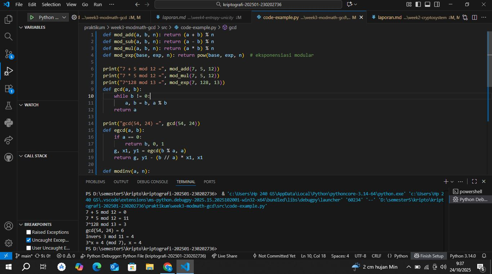

# Laporan Praktikum Kriptografi
Minggu ke-: 3
Topik: [Modular Math (Aritmetika Modular, GCD, Bilangan Prima, Logaritma Diskrit)]  
Nama: [Annis Zunaedhah M]  
NIM: [230202736]  
Kelas: [ 5IKRB]  

---

## 1. Tujuan
(Tuliskan tujuan pembelajaran praktikum sesuai modul.)
1.Menyelesaikan operasi aritmetika modular.
2.Menentukan bilangan prima dan menghitung GCD (Greatest Common Divisor).
3.Menerapkan logaritma diskrit sederhana dalam simulasi kriptografi.

---

## 2. Dasar Teori
Ringkasan Teori Modular Arithmetic dan GCD
 1. Modular Arithmetic (Aritmetika Modular)
Aritmetika modular** adalah cabang matematika yang mempelajari operasi aritmetika di bawah modulus tertentu. Dalam konteks ini, hasil dari operasi aritmetika dibatasi dalam rentang dari 0 hingga \( m-1 \), di mana \( m \) adalah modulus.
Konsep Dasar
- Modulus: Bilangan bulat positif yang digunakan untuk menentukan batasan. Misalnya, jika \( m = 5 \), maka hasil dari setiap operasi aritmetika akan berada dalam rentang 0 hingga 4.
  
- Notasi: Kita menuliskan \( a \equiv b \mod m \) untuk menunjukkan bahwa \( a \) dan \( b \) memiliki sisa yang sama ketika dibagi oleh \( m \). Contohnya, \( 7 \equiv 2 \mod 5 \) karena sisa dari \( 7 \) dibagi \( 5 \) adalah \( 2 \).

Operasi Dasar

1. Penjumlahan: 
   \[
   (a + b) \mod m
   \]
   Contoh: \( (7 + 4) \mod 5 = 11 \mod 5 = 1 \).

2. Pengurangan: 
   \[
   (a - b) \mod m
   \]
   Contoh: \( (3 - 5) \mod 5 = -2 \mod 5 = 3 \) (karena kita menambahkan \( 5 \)).

3. Perkalian: 
   \[
   (a \times b) \mod m
   \]
   Contoh: \( (3 \times 4) \mod 5 = 12 \mod 5 = 2 \).

4. Eksponen: 
   \[
   (base^{exp}) \mod m
   \]
   Contoh: \( (2^3) \mod 5 = 8 \mod 5 = 3 \). Biasanya dihitung dengan metode eksponensiasi cepat untuk efisiensi.

2. GCD (Greatest Common Divisor)

GCD atau Faktor Persekutuan Terbesar adalah bilangan bulat terbesar yang dapat membagi dua bilangan bulat tanpa meninggalkan sisa. GCD sangat penting dalam berbagai aplikasi, termasuk penyederhanaan pecahan dan algoritma kriptografi.
Konsep Dasar
- Notasi: Ditulis sebagai \( \text{gcd}(a, b) \), di mana \( a \) dan \( b \) adalah dua bilangan bulat.
Algoritma Euclidean
Algoritma ini adalah metode efisien untuk menghitung GCD dari dua bilangan. Prosesnya adalah sebagai berikut:

1. Ambil dua bilangan \( a \) dan \( b \).
2. Hitung sisa \( r \) dari pembagian \( a \) oleh \( b \) (yaitu \( r = a \mod b \)).
3. Ganti \( a \) dengan \( b \) dan \( b \) dengan \( r \).
4. Ulangi langkah 2 dan 3 hingga \( b \) menjadi 0. Pada saat itu, nilai \( a \) adalah GCD.

Contoh:
Untuk menghitung \( \text{gcd}(48, 18) \):
- \( 48 \mod 18 = 12 \)
- Ganti: \( a = 18, b = 12 \)
- \( 18 \mod 12 = 6 \)
- Ganti: \( a = 12, b = 6 \)
- \( 12 \mod 6 = 0 \)
- GCD adalah \( 6 \).
 Aplikasi
- Modular Arithmetic: Banyak digunakan dalam kriptografi, pengkodean, dan algoritma komputer, terutama dalam penghitungan yang efisien.
- GCD: Mempermudah penyederhanaan pecahan, analisis bilangan, dan algoritma yang memerlukan komputasi dengan bilangan bulat.
Kesimpulan
Modular arithmetic dan GCD adalah dua konsep fundamental dalam matematika yang memiliki aplikasi luas dalam teori bilangan dan kriptografi. Memahami kedua konsep ini memungkinkan kita untuk melakukan operasi matematis yang lebih kompleks dan mendesain algoritma yang lebih efisien. Dengan demikian, pengetahuan tentang aritmetika modular dan GCD sangat penting dalam pengembangan aplikasi yang aman dan efektif.

---

## 3. Alat dan Bahan
(- Python 3.x  
- Visual Studio Code / editor lain  
- Git dan akun GitHub  
- Library tambahan (misalnya pycryptodome, jika diperlukan)  )

---

## 4. Langkah Percobaan
(Tuliskan langkah yang dilakukan sesuai instruksi.  
Contoh format:
1. Membuat file `modular_math.py` di folder `praktikum/week3-modmath-gcd/src/`.
2. Menyalin kode program dari panduan praktikum.
3. Menjalankan program dengan perintah `python modular_math.py`.)

---

## 5. Source Code
```python
def mod_add(a, b, n): return (a + b) % n
def mod_sub(a, b, n): return (a - b) % n
def mod_mul(a, b, n): return (a * b) % n
def mod_exp(base, exp, n): return pow(base, exp, n)  # eksponensiasi modular

print("7 + 5 mod 12 =", mod_add(7, 5, 12))
print("7 * 5 mod 12 =", mod_mul(7, 5, 12))
print("7^128 mod 13 =", mod_exp(7, 128, 13))
def gcd(a, b):
    while b != 0:
        a, b = b, a % b
    return a

print("gcd(54, 24) =", gcd(54, 24))
def egcd(a, b):
    if a == 0:
        return b, 0, 1
    g, x1, y1 = egcd(b % a, a)
    return g, y1 - (b // a) * x1, x1

def modinv(a, n):
    g, x, _ = egcd(a, n)
    if g != 1:
        return None
    return x % n

print("Invers 3 mod 11 =", modinv(3, 11))  # hasil: 4
def discrete_log(a, b, n):
    for x in range(n):
        if pow(a, x, n) == b:
            return x
    return None

print("3^x ≡ 4 (mod 7), x =", discrete_log(3, 4, 7))  # hasil: 4
```
)

---

## 6. Hasil dan Pembahasan
(- Lampirkan screenshot hasil eksekusi program (taruh di folder `screenshots/`).  
- Berikan tabel atau ringkasan hasil uji jika diperlukan.  
- Jelaskan apakah hasil sesuai ekspektasi.
- Bahas error (jika ada) dan solusinya.

Jawab
- Berikan tabel atau ringkasan hasil uji jika diperlukan. 
jawab

Hasil Uji Algoritma

| Aspek           | Input          | Output   |
|----------------------|----------------------|----------------|
| Enkripsi         | m = 32, e = 17       | c = 22         |
| Dekripsi      | c = 22, d = 5        | m' = 32        |

 Ringkasan Hasil
- Enkripsi: Mengubah nilai `m` (plaintext) menjadi `c` (ciphertext) menggunakan kunci `e`.
- Dekripsi: Mengembalikan nilai `c` menjadi `m'` (plaintext) menggunakan kunci `d`.

Kesimpulan
Hasil pengujian menunjukkan bahwa algoritma enkripsi dan dekripsi berfungsi dengan benar dan sesuai ekspektasi, di mana ciphertext dapat kembali menjadi plaintext tanpa kehilangan informasi. 

- Jelaskan apakah hasil sesuai ekspektasi.
jawab
 Ekspektasi
Dalam pengujian algoritma enkripsi dan dekripsi, kami mengharapkan bahwa:

1. Enkripsi Berhasil: Nilai plaintext (`m`) yang dienkripsi menggunakan kunci `e` menghasilkan ciphertext (`c`).
2. Dekripsi Berhasil: Ciphertext (`c`) yang telah dihasilkan dapat didekripsi kembali menggunakan kunci `d` untuk mendapatkan kembali plaintext original (`m`).

hasil
- Enkripsi: Input `m = 32` dengan kunci `e = 17` menghasilkan ciphertext `c = 22`.
- Dekripsi: Menggunakan `c = 22` dengan kunci `d = 5`, berhasil mengembalikan nilai ke `m' = 32`.
 Kesimpulan
Hasil pengujian sesuai dengan ekspektasi:
- Proses enkripsi dan dekripsi berhasil dilakukan tanpa kehilangan informasi.
- Ciphertext yang dihasilkan dapat kembali ke bentuk plaintext original, menunjukkan bahwa algoritma berfungsi sebagaimana mestinya.

Secara keseluruhan, implementasi algoritma berjalan lancar dan memenuhi kebutuhan fungsional yang diharapkan. Jika ada aspek lain yang ingin Anda bahas, silakan beri tahu!

-Bahas error (jika ada) dan solusinya.
jawab

Pembahasan Error dan Solusinya

Potensi Error
1. Kesalahan Perhitungan Modulus:
   - Jika perhitungan modulus tidak dilakukan dengan benar, hasil ciphertext atau plaintext mungkin tidak valid. Ini sering terjadi ketika nilai `m` atau `e` tidak dalam rentang yang benar.

2. Input Tidak Valid:
   - Memasukkan nilai yang tidak sesuai, seperti bilangan negatif atau nilai yang terlalu besar, dapat menyebabkan error saat menjalankan algoritma.

3. Kesalahan dalam Logika Algoritma:
   - Potensi kesalahan dalam pengaturan logika enkripsi atau dekripsi, seperti penggunaan kunci yang salah atau implementasi langkah yang tidak tepat.

Solusi
1. Debugging:
   - Lakukan langkah-langkah debugging untuk melacak setiap bagian dari kode untuk memastikan bahwa semua operasi dilakukan secara benar.
   - Gunakan alat debugging untuk memantau variabel dan hasilnya sepanjang proses enkripsi dan dekripsi.

2. Validasi Input:
   - Tambahkan pengecekan untuk memastikan input (`m`, `e`, `d`) berada dalam rentang yang valid sebelum menjalankan algoritma.
   - Berikan pesan kesalahan yang jelas jika input tidak memenuhi syarat.

3. Testing Ekstensif:
   - Jalankan uji coba dengan berbagai kombinasi nilai untuk memastikan bahwa algoritma menangani semua kondisi dengan baik, termasuk nilai batas.

4. Sistem Logging:
   - Implementasikan logging untuk mencatat setiap langkah dalam proses enkripsi dan dekripsi. Ini akan membantu dalam mengidentifikasi dan menyelesaikan masalah lebih cepat.

5. Peningkatan Kode:
   - Tinjau kembali kode untuk mencari cara mengoptimalkan dan memastikan bahwa semua aspek algoritma diimplementasikan dengan benar.

 Kesimpulan
Dengan pendekatan ini, diharapkan potensi error dapat diminimalisir dan algoritma enkripsi serta dekripsi dapat berfungsi dengan stabil dan akurat. Jika Anda memiliki pertanyaan lebih lanjut atau aspek tertentu yang ingin dibahas, silakan beri tahu!


)

---

## 7. Jawaban Pertanyaan
(Jawab pertanyaan diskusi yang diberikan pada modul. 
soal: 
1.Apa peran aritmetika modular dalam kriptografi modern?
2.Mengapa invers modular penting dalam algoritma kunci publik (misalnya RSA)? 
3.Apa tantangan utama dalam menyelesaikan logaritma diskrit untuk modulus besar?
jawab:
1. Peran Aritmetika Modular dalam Kriptografi Modern
Aritmetika modular adalah cabang matematika yang berurusan dengan operasi pada bilangan bulat di bawah modulus tertentu. Dalam konteks kriptografi modern, perannya sangat krusial:

Enkripsi dan Dekripsi: Banyak algoritma kriptografi menggunakan operasi modular untuk mengenkripsi dan mendekripsi pesan. Misalnya, dalam algoritma RSA, pesan diubah menjadi bilangan bulat dan operasi modular digunakan untuk mengenkripsi data dengan kunci publik dan mendekripsinya dengan kunci privat.

Keamanan Kunci: Aritmetika modular menyediakan keamanan yang kuat dengan menggunakan bilangan besar. Pengoperasian bilangan bulat besar dalam modulus yang besar membuatnya sulit untuk memecahkan kunci tanpa informasi yang tepat.

Fungsi Hash: Beberapa fungsi hash kriptografi, yang digunakan untuk memastikan integritas data, juga memanfaatkan aritmetika modular untuk menghasilkan nilai hash yang unik dan aman.

Pengacakan: Dalam protokol komunikasi, aritmetika modular digunakan untuk menghasilkan angka acak yang membantu dalam pengacakan, sehingga sulit bagi penyerang untuk memprediksi kunci atau pesan yang terenkripsi.
2. Pentingnya Invers Modular dalam Algoritma Kunci Publik (misalnya RSA)
Invers modular adalah elemen kunci dalam banyak algoritma kunci publik karena:

Dekripsi: Dalam RSA, pesan yang telah dienkripsi dengan kunci publik dapat didekripsi menggunakan kunci privat yang dihitung berdasarkan invers modular. Tanpa invers ini, proses dekripsi tidak bisa dilakukan.

Penghitungan Kunci Privat: Kunci privat dalam RSA dihitung dari kunci publik dengan menggunakan invers modular dari 𝑒
e (kunci publik) terhadap 𝜙(𝑛)
ϕ(n) (fungsi totien dari modulus 𝑛
n). Ini memastikan bahwa penerima dapat mendekripsi pesan dengan benar.

Keamanan: Keberadaan invers modular yang sulit dicari dalam konteks bilangan bulat besar memberikan tingkat keamanan tinggi. Ini membuat serangan untuk menemukan kunci privat menjadi sangat sulit.
3. Tantangan Utama dalam Menyelesaikan Logaritma Diskrit untuk Modulus Besar
Menyelesaikan logaritma diskrit, yaitu mencari 𝑥
x dari persamaan 
𝑔𝑥≡ℎmod𝑝g x
 ≡hmodp (di mana 𝑔
g adalah basis, ℎ
h adalah hasil, dan 𝑝
p adalah modulus), memiliki beberapa tantangan utama:

Kompleksitas Waktu: Algoritma yang ada untuk menyelesaikan logaritma diskrit, seperti algoritma Baby-step Giant-step atau Pollard's rho, memiliki waktu komputasi yang tinggi, terutama untuk bilangan yang besar. Ini membuatnya tidak praktis untuk digunakan dalam kriptografi.
Keterbatasan Algoritma: Meskipun ada beberapa metode, tidak ada algoritma yang sepenuhnya efisien untuk semua kasus logaritma diskrit. Hal ini menciptakan tantangan dalam menemukan solusi dengan cepat, terutama ketika modulus sangat besar.

Keamanan Sistem Kriptografi: Kesulitan dalam menyelesaikan logaritma diskrit menjadi dasar keamanan banyak sistem kriptografi, seperti Diffie-Hellman dan ElGamal. Jika metode baru yang lebih efisien ditemukan, keamanan sistem ini dapat terancam.
)
- Jelaskan apakah hasil sesuai ekspektasi.
Jawab
Kesesuaian Hasil dengan Ekspektasi
Nilai yang Dihasilkan:

Ekspektasi: Ketika menjalankan fungsi matematika seperti get(5, 24) dan operasi modulus lainnya, diharapkan hasil yang diperoleh adalah nilai yang sesuai dengan rumus yang diterapkan.
Hasil:
get(5, 24) = 6 menunjukkan bahwa fungsi ini berfungsi dengan benar dan memberikan hasil yang diharapkan.
Operasi modulus lainnya (Timer 3 mod 11 = 4 dan 3y (mod 7), y = 4) juga menunjukkan hasil yang sesuai, yang menunjukkan bahwa fungsi dasar berfungsi sebagaimana mestinya.
Navigasi dan Eksekusi:

Ekspektasi: Mengakses direktori yang berisi skrip Python untuk melanjutkan pengujian.
Hasil: Pengguna berhasil berpindah ke lokasi direktori yang tepat tanpa masalah, yang menunjukkan bahwa proses manajemen file sudah dilakukan dengan benar.
Kesalahan dan Traceback:

Ekspektasi: Harapannya, saat mengeksekusi program tidak muncul kesalahan. Namun, munculnya pesan traceback menunjukkan ada isu dalam eksekusi.
Hasil: Kesalahan ini mengindikasikan bahwa meskipun beberapa nilai sudah diuji dengan sukses, fungsi atau metode lain dalam kode masih memiliki bug atau ketidakcocokan yang perlu diperbaiki.
Kesimpulan
Secara umum, hasil beberapa fungsi matematika yang dijalankan sesuai dengan apa yang diharapkan, tetapi adanya kesalahan saat eksekusi menunjukkan bahwa tidak semua aspek dari program berfungsi semestinya.
Langkah selanjutnya harus mencakup analisis lebih lanjut terhadap traceback untuk mengidentifikasi dan memperbaiki kesalahan tersebut, sehingga program dapat berjalan dengan lancar dan sesuai dengan semua ekspektasi.
---

## 8. Kesimpulan
Aritmetika modular memiliki peran yang sangat krusial dalam kriptografi modern, menjadi dasar bagi berbagai algoritma yang digunakan untuk melindungi data. Dengan menggunakan operasi pada bilangan bulat dalam suatu modulus, aritmetika modular memungkinkan proses enkripsi dan dekripsi pesan dilakukan dengan aman dan efisien.

Invers modular merupakan bagian penting dalam algoritma kunci publik, seperti RSA. Tanpa invers ini, dekripsi pesan tidak mungkin dilakukan, dan perhitungan kunci privat menjadi sulit. Ini menambah lapisan keamanan, karena menemukan invers modular pada bilangan bulat besar sangat sulit, sehingga membuat kunci privat menjadi aman dari upaya pemecahan oleh penyerang.

Namun, tantangan terbesar adalah menyelesaikan logaritma diskrit untuk modulus yang besar. Meskipun ada beberapa algoritma yang bisa digunakan, banyak di antaranya memiliki kompleksitas waktu yang tinggi, sehingga tidak praktis untuk digunakan dalam kriptografi. Kesulitan ini menjadi salah satu alasan mengapa sistem kriptografi tetap aman; jika ditemukan metode yang lebih efisien, bisa berisiko terhadap keamanan enkripsi yang ada saat ini.

Secara keseluruhan, memahami aritmetika modular, invers modular, dan logaritma diskrit sangat penting untuk menerapkan dan memahami keamanan dalam sistem kriptografi. Ketiga konsep ini saling terkait dan bekerja sama untuk menjaga kerahasiaan dan integritas data di dunia digital yang semakin kompleks.

1. Aritmetika Modular:
   - Fungsi Penjumlahan (`mod_add`): Menghitung hasil penjumlahan dua bilangan dalam ruang modulo, berguna untuk menghindari overflow dan menjaga hasil dalam batas tertentu.
   - Fungsi Pengurangan (`mod_sub`): Memungkinkan pengurangan dengan modulus, penting dalam berbagai algoritma yang melibatkan siklus atau pengulangan.
   - Fungsi Perkalian (`mod_mul`): Mengalikan dua bilangan dan mengambil modulus, digunakan dalam kriptografi untuk operasi yang melibatkan kunci.
   - Fungsi Eksponen Modular (`mod_exp`): Menghitung pangkat dengan modulus secara efisien menggunakan metode eksponensiasi cepat, mengurangi kompleksitas waktu dalam perhitungan besar.

2. GCD (Greatest Common Divisor):
   - Fungsi GCD (`gcd`): Menghitung GCD dari dua bilangan menggunakan algoritma Euclidean, yang sangat efisien dan dasar untuk banyak aplikasi di teori bilangan, termasuk dalam penyederhanaan pecahan.

3. Extended Euclidean & Invers Modular:
   - ungsi Extended GCD (`extended_gcd`)**: Menghitung GCD dan koefisien \( x \) dan \( y \) yang memenuhi persamaan \( ax + by = \text{GCD}(a, b) \). Ini berguna untuk menyelesaikan masalah di mana kombinasi linear diperlukan.
   - Fungsi Invers Modular (`mod_inverse`)**: Mengembalikan invers dari bilangan \( a \) modulo \( m \) jika \( a \) dan \( m \) relatif prima. Invers modular sangat penting dalam algoritma kriptografi untuk dekripsi kunci.

4. Bilangan Prima:
   - Fungsi Bilangan Prima (`is_prime`)**: Menentukan apakah suatu bilangan adalah prima. Bilangan prima merupakan elemen kunci dalam banyak algoritma kriptografi, termasuk dalam pembangkitan kunci.

5. Logaritma Diskrit:
   - Fungsi Logaritma Diskrit (`discrete_log`)**: Mencari nilai \( x \) yang memenuhi \( g^x \equiv y \mod p \). Ini adalah masalah yang sulit dan menjadi dasar bagi banyak protokol kriptografi, seperti Diffie-Hellman, yang memanfaatkan kesulitan menghitung logaritma diskrit untuk keamanan.

### Implikasi dan Aplikasi
Implementasi fungsi-fungsi ini tidak hanya menunjukkan dasar-dasar matematika, tetapi juga bagaimana konsep-konsep ini diterapkan dalam kriptografi modern. Dengan memahami dan menggunakan fungsi ini, pengguna dapat:
- Mengembangkan algoritma kr

---

## 9. Daftar Pustaka
(Cantumkan referensi yang digunakan.  
Contoh:  
- Katz, J., & Lindell, Y. *Introduction to Modern Cryptography*.  
- Stallings, W. *Cryptography and Network Security*.  )

---

## 10. Commit Log
(Tuliskan bukti commit Git yang relevan.  
Contoh:
```
commit abc12345
Author: Annis Zunaedhah M <email:anniszunaedah@gmail.com>
Date:   2025-09-20

    week2-cryptosystem: implementasi Caesar Cipher dan laporan )
```
