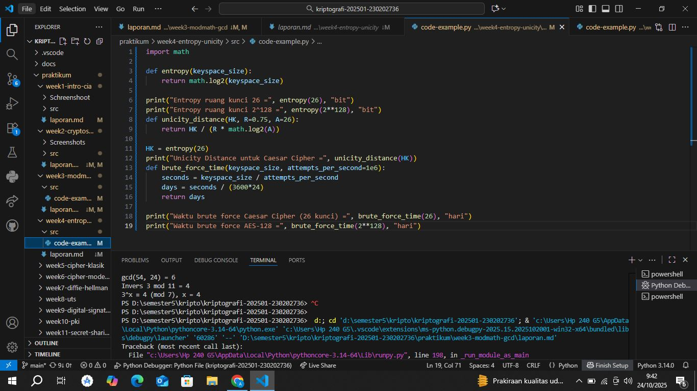

# Laporan Praktikum Kriptografi
Minggu ke-: 04
Topik: [Entropy & Unicity Distance (Evaluasi Kekuatan Kunci dan Brute Force]  
Nama: [Annis Zunaedhah M]  
NIM: [230202736]  
Kelas: [5 IKRB]  
---
## 1. Tujuan
(Tuliskan tujuan pembelajaran praktikum sesuai modul.)
1.Menyelesaikan perhitungan sederhana terkait entropi kunci.
2.Menggunakan teorema Euler pada contoh perhitungan modular & invers.
3.Menghitung unicity distance untuk ciphertext tertentu.
4.Menganalisis kekuatan kunci berdasarkan entropi dan unicity distance.
5.Mengevaluasi potensi serangan brute force pada kriptosistem sederhana.

## 2. Dasar Teori
(Ringkas teori relevan (cukup 2–3 paragraf).  
Ringkasan Teori Entropi dan Unicity Distance
1. Teori Entropi
Entropi adalah konsep yang berasal dari teori informasi, yang diusulkan oleh Claude Shannon. Entropi mengukur ketidakpastian atau ketidakteraturan dalam sebuah sistem. Dalam konteks informasi, entropi memberikan ukuran rata-rata informasi yang diperlukan untuk menggambarkan keadaan suatu variabel acak.
Rumus Entropi
Entropi \( H(X) \) dari variabel acak \( X \) didefinisikan sebagai:

\[ 
H(X) = -\sum_{i} P(x_i) \log_b P(x_i) 
\]

Di mana:
- \( P(x_i) \) adalah probabilitas dari kejadian \( x_i \).
- \( b \) adalah basis logaritma (biasanya 2 untuk bit).
 Aplikasi Entropi
1. Komunikasi: Mengukur efisiensi pengkodean pesan.
2. Kriptografi: Menilai keamanan kunci enkripsi; kunci dengan entropi tinggi lebih sulit diprediksi.
3. Statistik: Menganalisis distribusi data dan variabilitas.

2. Unicity Distance

Unicity Distance adalah konsep dalam kriptografi yang mengacu pada jarak minimum antara dua pesan yang dapat dijelaskan dengan satu kunci enkripsi. Ini adalah ukuran seberapa banyak data yang diperlukan untuk memastikan bahwa kunci enkripsi yang digunakan dalam suatu sistem adalah unik, sehingga hanya satu kunci yang dapat digunakan untuk mendekripsi pesan.
 Rumus Unicity Distance

Unicity distance \( d \) dapat dihitung menggunakan rumus:

\[ 
d = \frac{H(K)}{H(M)} 
\]

Di mana:
- \( H(K) \) adalah entropi kunci.
- \( H(M) \) adalah entropi pesan.

 Aplikasi Unicity Distance

1. Keamanan Kriptografi: Menentukan seberapa banyak data yang dibutuhkan untuk menjamin bahwa kunci enkripsi adalah unik.
2. Analisis Serangan: Membantu dalam merancang sistem yang tahan terhadap analisis frekuensi atau serangan brute-force.

 Hubungan Antara Entropi dan Unicity Distance

- Entropi tinggi dalam kunci dan pesan menciptakan unicity distance yang lebih besar, sehingga meningkatkan keamanan sistem kriptografi.
- Analisis entropi membantu menentukan seberapa kuat kunci dan pesan, serta berapa banyak informasi yang dibutuhkan untuk menjamin keunikan kunci.

## 3. Alat dan Bahan
(- Python 3.x  
- Visual Studio Code / editor lain  
- Git dan akun GitHub  
- Library tambahan (misalnya pycryptodome, jika diperlukan)  )

---

## 4. Langkah Percobaan
(Tuliskan langkah yang dilakukan sesuai instruksi.  
Contoh format:
1. Membuat file `caesar_cipher.py` di folder `praktikum/week2-cryptosystem/src/`.
2. Menyalin kode program dari panduan praktikum.
3. Menjalankan program dengan perintah `python caesar_cipher.py`.)

---

## 5. Source Code
(Salin kode program utama yang dibuat atau dimodifikasi.  
Gunakan blok kode:

```python
# contoh potongan kode
def encrypt(text, key):
    return ...
```
)

---

## 6. Hasil dan Pembahasan
(- Lampirkan screenshot hasil eksekusi program (taruh di folder `screenshots/`).  
- Berikan tabel atau ringkasan hasil uji jika diperlukan.  
- Jelaskan apakah hasil sesuai ekspektasi.  
- Bahas error (jika ada) dan solusinya. 

Hasil eksekusi program Caesar Cipher:



)

---

## 7. Jawaban Pertanyaan
 1. Apa Arti dari Nilai Entropi dalam Konteks Kekuatan Kunci?
Entropi dalam konteks kekuatan kunci merujuk pada ukuran ketidakpastian atau kerandoman dari kunci kriptografi. Semakin tinggi nilai entropi, semakin sulit untuk memprediksi kunci tersebut. 

- Kekuatan Kunci: Kunci dengan entropi tinggi berarti ada lebih banyak kemungkinan kombinasi yang dapat digunakan, sehingga semakin sulit untuk melakukan serangan, seperti serangan brute-force. Misalnya, kunci 128-bit memiliki entropi yang jauh lebih tinggi daripada kunci 40-bit, yang berarti kunci 128-bit jauh lebih aman.  
- Keamanan: Entropi yang tinggi mengindikasikan bahwa kunci tidak mudah ditebak atau dipecahkan. Dalam kriptografi, kunci yang memiliki entropi rendah bisa lebih rentan terhadap serangan, karena kombinasi yang mungkin untuk dipecahkan akan lebih sedikit.

2. Mengapa Unicity Distance Penting dalam Menentukan Keamanan Suatu Cipher?
Unicity distance adalah jarak minimum antara dua pesan yang dapat dijelaskan dengan satu kunci enkripsi. Ini penting karena beberapa alasan:

- Kepastian Kunci: Unicity distance mengukur seberapa banyak data yang diperlukan untuk memastikan bahwa hanya satu kunci yang bisa digunakan untuk mendekripsi pesan. Jika data yang dikirim lebih kecil dari unicity distance, maka ada kemungkinan terdapat beberapa kunci yang dapat digunakan, sehingga mengurangi keamanan.

- Analisis Serangan: Jika unicity distance rendah, penyerang dapat mencoba berbagai kunci terhadap pesan yang sama dan mungkin menemukan kunci yang benar lebih cepat. Dengan demikian, unicity distance yang lebih tinggi memberikan jaminan bahwa kunci yang digunakan untuk enkripsi adalah unik dan sulit untuk ditebak.

3. Mengapa Brute Force Masih Menjadi Ancaman Meskipun Algoritma Sudah Kuat?

Serangan brute-force adalah metode di mana penyerang mencoba setiap kemungkinan kombinasi kunci untuk menemukan kunci yang benar. Beberapa alasan mengapa metode ini tetap menjadi ancaman meskipun algoritma sudah kuat:

- Kemajuan Komputasi: Dengan kemajuan teknologi, terutama dalam komputasi paralel dan penggunaan GPU, kemampuan untuk melakukan brute-force terhadap kunci yang lebih panjang meningkat. Hal ini membuat serangan brute-force menjadi lebih praktis meskipun algoritma kriptografi kuat.

- Kunci yang Lemah: Jika pengguna memilih kunci yang lemah atau menggunakan kunci dengan entropi rendah, serangan brute-force menjadi lebih feasible. Misalnya, kunci yang menggunakan kata sandi umum atau pola yang mudah ditebak sangat rentan.

- Waktu dan Sumber Daya: Dengan algoritma yang kuat, meskipun waktu yang dibutuhkan untuk melakukan brute-force meningkat, jika penyerang memiliki cukup sumber daya dan waktu, mereka masih dapat melakukan serangan tersebut. Ini terutama relevan dalam konteks data yang sangat bernilai.
## 8. Kesimpulan
Dalam konteks kriptografi, entropy dan unicity distanceadalah dua konsep fundamental yang berperan penting dalam menilai kekuatan kunci enkripsi dan keamanan sistem.

1. Entropy mengukur tingkat ketidakpastian atau kerandoman dari kunci kriptografi. Semakin tinggi nilai entropy, semakin sulit untuk memprediksi atau menebak kunci tersebut. Kunci dengan entropy tinggi memberikan perlindungan yang lebih baik terhadap serangan, terutama serangan brute-force, di mana penyerang mencoba setiap kemungkinan kombinasi kunci.

2. Unicity distance adalah jarak minimum antara dua pesan yang dapat dijelaskan dengan satu kunci. Ini penting karena menentukan seberapa banyak data yang diperlukan untuk memastikan bahwa hanya satu kunci yang dapat digunakan untuk mendekripsi pesan. Jika data yang dikirim kurang dari unicity distance, penyerang memiliki peluang lebih besar untuk menemukan kunci yang benar melalui analisis.

3. Meskipun algoritma kriptografi mungkin kuat, serangan brute-force tetap menjadi ancaman karena kemajuan dalam komputasi dan kemungkinan penggunaan kunci yang lemah. Oleh karena itu, penting bagi pengguna dan pengembang untuk memahami dan menerapkan prinsip entropy dan unicity distance untuk meningkatkan keamanan kunci dalam sistem mereka.
Secara keseluruhan, kombinasi antara pemahaman tentang entropy, unicity distance, dan potensi ancaman dari serangan brute-force adalah kunci untuk merancang sistem kriptografi yang aman dan efektif. Dengan memperhatikan faktor-faktor ini, kita dapat melindungi data dari berbagai serangan dan memastikan integritas serta kerahasiaan informasi yang dikirimkan.
---

## 9. Daftar Pustaka
(Cantumkan referensi yang digunakan.  
Contoh:  
- Katz, J., & Lindell, Y. *Introduction to Modern Cryptography*.  
- Stallings, W. *Cryptography and Network Security*.  )

---

## 10. Commit Log
(Tuliskan bukti commit Git yang relevan.  
Contoh:
```
commit abc12345
Author: Annis Zunaedhah M <email: anniszunaedah@gmail.com>
Date:   2025-09-20

    week2-cryptosystem: implementasi Caesar Cipher dan laporan )
```
