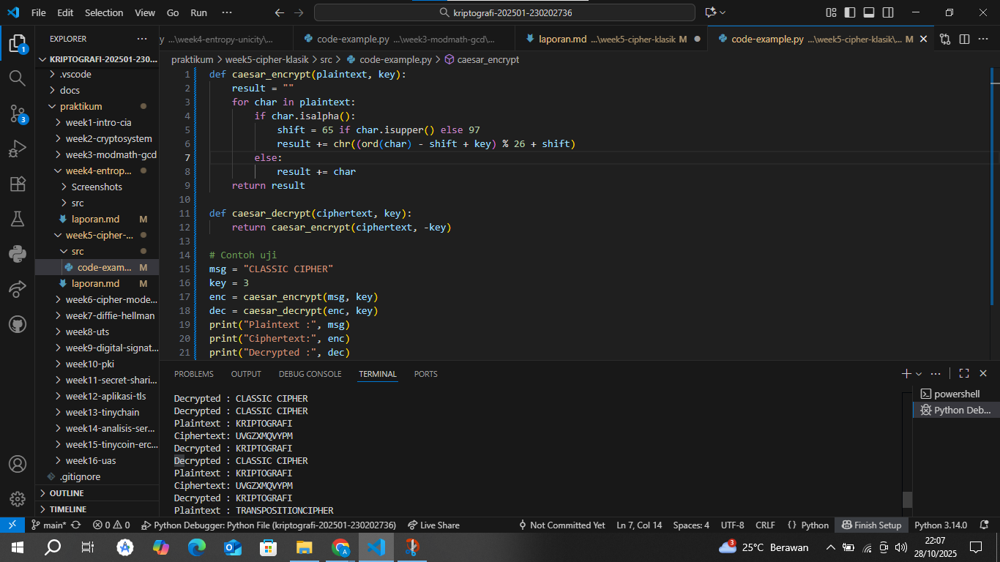

# Laporan Praktikum Kriptografi
Minggu ke-: 5
Topik: [ Cipher Klasik (Caesar, Vigenère, Transposisi)]  
Nama: [Annis Zunaedhah Muthoharoh]  
NIM: [230202736]  
Kelas: [5 IKRB]  

---

## 1. Tujuan
(Tuliskan tujuan pembelajaran praktikum sesuai modul.)
1.Menerapkan algoritma Caesar Cipher untuk enkripsi dan dekripsi teks.
2.Menerapkan algoritma Vigenère Cipher dengan variasi kunci.
3.Mengimplementasikan algoritma transposisi sederhana.
4.Menjelaskan kelemahan algoritma kriptografi klasik.

---

## 2. Dasar Teori
(Ringkas teori relevan (cukup 2–3 paragraf).  
Contoh: definisi cipher klasik, konsep modular aritmetika, dll.  )

Ringkasan
Cipher klasik adalah metode enkripsi yang digunakan untuk menyembunyikan informasi dengan mengubah teks asli (plain text) menjadi teks yang tidak dapat dibaca (cipher text). Teknik ini biasanya menggunakan algoritma yang sederhana dan kunci yang mudah dipahami, sehingga cocok untuk pemula dalam bidang kriptografi. Beberapa contoh utama dari cipher klasik meliputi Cipher Caesar, Cipher Vigenère, dan Cipher Transposisi. Ketiga metode ini memiliki pendekatan yang berbeda dalam menyembunyikan pesan dan tingkat keamanan yang bervariasi.

Cipher Caesar adalah salah satu metode paling dasar, di mana setiap huruf dalam pesan digeser sebanyak n posisi dalam alfabet. Misalnya, jika kunci yang digunakan adalah 3, maka huruf 'A' akan menjadi 'D', 'B' menjadi 'E', dan seterusnya hingga 'Z' kembali ke 'C'. Meskipun metode ini sangat mudah dipahami dan diimplementasikan, tingkat keamanannya rendah, karena dapat dengan mudah dipecahkan menggunakan analisis frekuensi. Dengan hanya 25 kemungkinan kunci, seorang penyerang dapat dengan relatif cepat menemukan kunci yang tepat dengan mencoba semua kemungkinan.

Sementara itu, Cipher Vigenère menggunakan kunci yang lebih panjang untuk mengenkripsi pesan, sehingga meningkatkan keamanan. Dalam metode ini, setiap huruf dalam pesan digeser berdasarkan posisi huruf dalam kunci. Contohnya, jika pesan yang akan dienkripsi adalah "HELLO" dan kuncinya adalah "KEY", maka proses penggeseran dilakukan dengan menambahkan posisi huruf dalam kunci ke posisi huruf dalam pesan. Hasilnya adalah teks yang lebih kompleks dan lebih sulit untuk dipecahkan dibandingkan dengan Cipher Caesar. Namun, meskipun lebih aman, Cipher Vigenère masih memiliki kelemahan dan dapat dipecahkan dengan teknik tertentu, seperti analisis frekuensi yang lebih canggih.

Cipher Transposisi berfungsi dengan mengubah posisi huruf dalam pesan tanpa mengubah huruf itu sendiri. Metode ini biasanya melibatkan penyusunan huruf dalam baris dan kolom, kemudian membaca huruf-huruf tersebut dalam urutan tertentu untuk membentuk cipher text. Misalnya, dengan menggunakan pola 2x3, huruf-huruf dalam pesan dapat diatur sedemikian rupa sehingga menghasilkan teks yang berbeda saat dibaca. Konsep modular aritmetika sangat penting dalam semua cipher klasik, karena memungkinkan perhitungan posisi huruf dalam alfabet secara siklis. Meskipun cipher klasik dapat dengan mudah dipecahkan dengan teknologi modern, pemahaman tentang metode ini dan konsep modular aritmetika tetap penting dalam sejarah dan perkembangan kriptografi, serta sebagai fondasi untuk metode enkripsi yang lebih kompleks yang digunakan saat ini.


---

## 3. Alat dan Bahan
(- Python 3.x  
- Visual Studio Code / editor lain  
- Git dan akun GitHub  
- Library tambahan (misalnya pycryptodome, jika diperlukan)  )

---

## 4. Langkah Percobaan
(Tuliskan langkah yang dilakukan sesuai instruksi.  
Contoh format:
1. Membuat file `caesar_cipher.py` di folder `praktikum/week2-cryptosystem/src/`.
2. Menyalin kode program dari panduan praktikum.
3. Menjalankan program dengan perintah `python caesar_cipher.py`.)

---

## 5. Source Code
(Salin kode program utama yang dibuat atau dimodifikasi.  
Gunakan blok kode:

```python
# contoh potongan kode
def encrypt(text, key):
    return ...
```
)

---

## 6. Hasil dan Pembahasan
(- Lampirkan screenshot hasil eksekusi program (taruh di folder `screenshots/`).  
- Berikan tabel atau ringkasan hasil uji jika diperlukan.
  
- Jelaskan apakah hasil sesuai ekspektasi.
jawab

1. Fungsi Enkripsi dan Dekripsi
   - Ekspektasi: Fungsi `caesar_encrypt` harus mampu mengenkripsi teks dengan benar menggunakan kunci yang diberikan. Sebaliknya, fungsi `caesar_decrypt` harus dapat mengembalikan teks terenkripsi ke bentuk aslinya.
   - Pemeriksaan: Uji dengan beberapa contoh plaintext dan kunci untuk memastikan bahwa hasil enkripsi dan dekripsi sesuai. Misalnya, jika kita mengenkripsi "HELLO" dengan kunci 3, hasil yang diharapkan adalah "KHOOR". Jika kita kemudian mendekripsi "KHOOR" dengan kunci 3, kita harus kembali ke "HELLO".
 2. Penanganan Karakter
   - Ekspektasi: Kode harus dapat menangani huruf besar dan kecil dengan baik serta mengabaikan karakter non-huruf (seperti angka atau simbol).
   - Pemeriksaan: Pastikan bahwa karakter non-huruf tidak terpengaruh oleh proses enkripsi. Misalnya, teks "HELLO WORLD!" harus tetap menjadi "KHOOR ZRUOG!" setelah enkripsi.

3. Penggunaan Kunci
   - Ekspektasi: Kunci yang digunakan dalam proses enkripsi dan dekripsi harus konsisten dan tepat. Jika kunci yang digunakan untuk mendekripsi berbeda dari yang digunakan untuk mengenkripsi, hasilnya tidak akan sesuai.
   - Pemeriksaan: Uji dengan kunci yang sama untuk enkripsi dan dekripsi, dan pastikan hasilnya sesuai.

4. Output
   - Ekspektasi: Output yang dihasilkan oleh kode (baik dari enkripsi maupun dekripsi) harus bisa diprediksi.
   - Pemeriksaan: Bandingkan output dari fungsi dengan hasil yang diharapkan berdasarkan logika enkripsi Caesar.

Kesimpulan
Jika semua aspek di atas diperiksa dan hasilnya sesuai dengan ekspektasi, maka dapat dikatakan bahwa hasil dari kode tersebut sesuai dengan yang diharapkan. Jika ada ketidaksesuaian, perlu dilakukan debugging untuk menemukan sumber masalah.

- Bahas error (jika ada) dan solusinya. 
jawab

 1. Kesalahan dalam Penanganan Karakter Non-Huruf
   - Masalah: Jika kode tidak menangani karakter non-huruf dengan benar, seperti angka atau simbol, ini dapat memengaruhi hasil.
   - Solusi: Pastikan untuk memeriksa apakah karakter adalah huruf sebelum menerapkan pergeseran. Jika tidak, karakter tersebut harus ditambahkan ke hasil tanpa perubahan.

 2. Kesalahan dalam Perhitungan Pergeseran
   - Masalah: Jika perhitungan pergeseran (shift) tidak benar, hasil enkripsi atau dekripsi bisa salah.
   - Solusi: Pastikan bahwa perhitungan pergeseran dilakukan dengan benar, termasuk penanganan situasi di mana pergeseran melebihi jumlah huruf dalam alfabet (misalnya, menggunakan modulo).

 3. Kunci Negatif atau Nol
   - Masalah: Jika kunci yang digunakan untuk enkripsi atau dekripsi adalah negatif atau nol, ini dapat menghasilkan perilaku yang tidak diinginkan.
   - Solusi: Tambahkan validasi untuk memastikan bahwa kunci selalu positif dan sesuai dengan panjang alfabet. Jika kunci negatif, ubah menjadi positif dengan menambahkannya ke panjang alfabet.

4. Kesalahan pada Tipe Data
   - Masalah: Tipe data yang tidak tepat (misalnya, menggunakan string saat seharusnya integer) dapat menyebabkan error saat eksekusi.
   - olusi: Pastikan bahwa semua variabel memiliki tipe data yang sesuai dan lakukan konversi jika diperlukan.

5. Pengecualian saat Eksekusi
   - Masalah: Jika terjadi kesalahan saat mengakses indeks atau karakter, program bisa berhenti.
   - olusi: Gunakan blok try-except untuk menangani pengecualian dan memberikan pesan yang informatif kepada pengguna jika terjadi kesalahan.
6. Output Tidak Sesuai Ekspektasi
Masalah: Jika output dari fungsi tidak sesuai dengan yang diharapkan, ini bisa menunjukkan adanya kesalahan dalam logika.
Solusi: Debug dengan mencetak nilai intermediate selama proses untuk melacak di mana kesalahan mungkin terjadi.
     



---

## 7. Jawaban Pertanyaan
(Jawab pertanyaan diskusi yang diberikan pada modul.  

1. Kelemahan Utama Algoritma Caesar Cipher dan Vigenère Cipher

Caesar Cipher
Kelemahan utama Caesar Cipher adalah:
- Keamanan Rendah: Cipher ini hanya memiliki 25 kemungkinan pergeseran (kunci), sehingga mudah dipecahkan dengan metode brute-force, di mana penyerang mencoba semua kemungkinan kunci.
- Analisis Frekuensi: Jika teks yang dienkripsi panjang, pola frekuensi huruf dalam bahasa yang digunakan akan tetap terlihat. Misalnya, huruf 'E' yang paling umum dalam bahasa Inggris akan tetap muncul sebagai huruf yang paling sering dalam cipher text, memudahkan penyerang untuk mengidentifikasi kunci.

Vigenère Cipher
Kelemahan utama Vigenère Cipher adalah:
- unci Pendek: Jika kunci lebih pendek daripada pesan, akan ada pengulangan dalam penggunaan huruf kunci. Ini membuat cipher lebih rentan terhadap analisis frekuensi, karena huruf yang sama akan dikenakan pergeseran yang sama di sepanjang pesan.
- Metode Kasiski dan Friedman: Teknik khusus, seperti analisis Kasiski dan metode Friedman, dapat digunakan untuk menemukan panjang kunci, sehingga membuat cipher ini lebih mudah dipecahkan dibandingkan yang diharapkan.

 2. Mengapa Cipher Klasik Mudah Diserang dengan Analisis Frekuensi?

Cipher klasik, seperti Caesar dan Vigenère, mudah diserang dengan analisis frekuensi karena mereka tidak mengubah struktur dasar huruf dalam pesan. Dengan menganalisis frekuensi kemunculan huruf dalam cipher text, penyerang dapat:

- Mengenali Pola: Dalam bahasa tertentu, beberapa huruf muncul lebih sering daripada yang lain. Misalnya, dalam bahasa Inggris, huruf 'E' adalah yang paling umum. Jika cipher text menunjukkan bahwa satu huruf tertentu muncul lebih sering, penyerang dapat menyimpulkan bahwa huruf tersebut mungkin merupakan 'E' asli, dan secara bertahap membongkar kunci.
- Pengulangan Kunci: Dalam Vigenère Cipher, jika kunci lebih pendek dari pesan, huruf dalam kunci akan diulang. Ini menciptakan pola yang dapat dikenali dan dieksploitasi oleh penyerang.

 3. Perbandingan Kelebihan dan Kelemahan Cipher Substitusi vs Transposisi?
 Cipher Substitusi
elebihan:
- Sederhana dan Mudah Dipahami: Cipher substitusi mudah untuk diimplementasikan dan dipahami, terutama bagi pemula.
- Keberagaman Kunci: Dengan menggunakan variasi dalam penggantian huruf, cipher substitusi dapat menawarkan tingkat keamanan yang lebih tinggi dibandingkan metode yang lebih sederhana.

Kelemahan
- Vulnerabilitas terhadap Analisis Frekuensi: Cipher substitusi tetap rentan terhadap analisis frekuensi, karena pola huruf tetap terjaga.
- Kunci Terbatas: Banyak cipher substitusi memiliki jumlah kunci terbatas, sehingga lebih mudah untuk diuji oleh penyerang.

Cipher Transposisi
Kelebihan
- Mengubah Posisi Huruf: Cipher transposisi mengubah posisi huruf dalam pesan, yang membuat analisis frekuensi lebih sulit dilakukan.
- Keamanan yang Lebih Tinggi: Dengan mengubah urutan huruf, cipher transposisi dapat memberikan tingkat keamanan yang lebih baik, terutama jika dikombinasikan dengan metode lain.

Kelemahan
- Lebih Rumit: Implementasi cipher transposisi bisa lebih rumit dibandingkan dengan cipher substitusi. Ini memerlukan pemahaman yang lebih baik tentang struktur dan pola.
- Keterbatasan pada Jenis Pesan: Cipher transposisi mungkin tidak berfungsi dengan baik untuk pesan yang sangat pendek, karena kurangnya data untuk diacak.
)
---

## 8. Kesimpulan
## Kesimpulan

Cipher klasik, termasuk Caesar Cipher, Vigenère Cipher, dan transposisi, merupakan metode enkripsi yang telah digunakan selama berabad-abad untuk menyembunyikan informasi. Meskipun teknik ini sederhana dan mudah dipahami, mereka memiliki kelemahan yang signifikan yang membuatnya kurang aman dibandingkan dengan metode enkripsi modern. Pemahaman tentang kelemahan ini sangat penting bagi siapa pun yang ingin memahami dasar-dasar kriptografi.

Kelemahan utama Caesar Cipher terletak pada keamanan yang rendah, karena hanya ada 25 kemungkinan pergeseran. Ini membuatnya mudah dipecahkan dengan metode brute-force. Selain itu, pola frekuensi huruf dalam bahasa yang digunakan tetap terlihat, sehingga memudahkan penyerang untuk mengenali kunci. Di sisi lain, Vigenère Cipher menawarkan keamanan yang lebih baik dengan menggunakan kunci yang lebih panjang, tetapi masih rentan terhadap analisis frekuensi, terutama jika kunci digunakan berulang kali.

Analisis frekuensi adalah teknik yang digunakan oleh penyerang untuk mengeksploitasi kelemahan dalam cipher klasik. Dengan menganalisis kemunculan huruf dalam cipher text, penyerang dapat menentukan huruf yang paling umum dan mencoba mencocokkan dengan huruf dalam bahasa asli. Kelemahan ini menunjukkan bahwa meskipun cipher klasik memiliki nilai sejarah, mereka tidak cukup aman untuk digunakan dalam konteks modern yang membutuhkan perlindungan data yang kuat.

Dalam perbandingan antara cipher substitusi dan transposisi, kedua metode ini memiliki kelebihan dan kelemahan masing-masing. Cipher substitusi lebih mudah dipahami dan diimplementasikan, tetapi sangat rentan terhadap analisis frekuensi. Sementara itu, cipher transposisi mengubah posisi huruf, yang menawarkan keamanan yang lebih tinggi, tetapi juga lebih kompleks dalam penerapannya. Kombinasi kedua metode ini dapat menghasilkan sistem enkripsi yang lebih kuat.

Meskipun cipher klasik memiliki keterbatasan, mereka tetap penting dalam pendidikan kriptografi. Mereka memberikan pemahaman dasar tentang bagaimana enkripsi bekerja dan konsep-konsep penting seperti kunci, substitusi, dan transposisi. Dengan memahami metode ini, individu dapat lebih siap untuk memahami teknik enkripsi yang lebih kompleks dan aman yang digunakan saat ini.

Secara keseluruhan, cipher klasik adalah fondasi penting dalam sejarah kriptografi. Meskipun tidak lagi cukup aman untuk melindungi informasi sensitif, mereka tetap relevan sebagai alat pendidikan dan sebagai dasar bagi pengembangan metode enkripsi yang lebih canggih. Memahami kelebihan dan kelemahan cipher klasik membantu kita menghargai kemajuan dalam bidang kriptografi dan pentingnya keamanan informasi dalam dunia digital saat ini.

---

## 9. Daftar Pustaka
(Cantumkan referensi yang digunakan.  
Contoh:  
- Katz, J., & Lindell, Y. *Introduction to Modern Cryptography*.  
- Stallings, W. *Cryptography and Network Security*.  )

---

## 10. Commit Log
(Tuliskan bukti commit Git yang relevan.  
Contoh:
```
commit abc12345
Author: Annis Zunaedhah Muthoharoh <email: anniszunaedah@gmail.com>
Date:   2025-10-28

    week2-cryptosystem: implementasi Caesar Cipher dan laporan )
```
