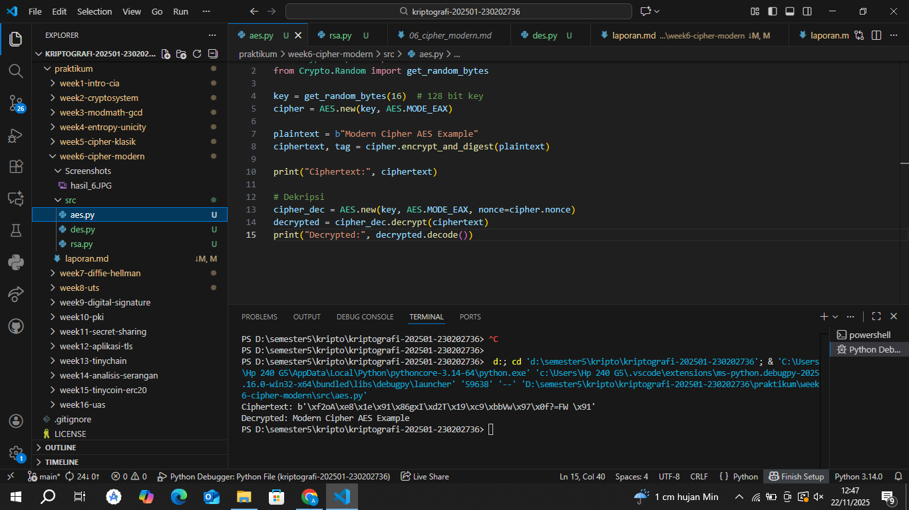
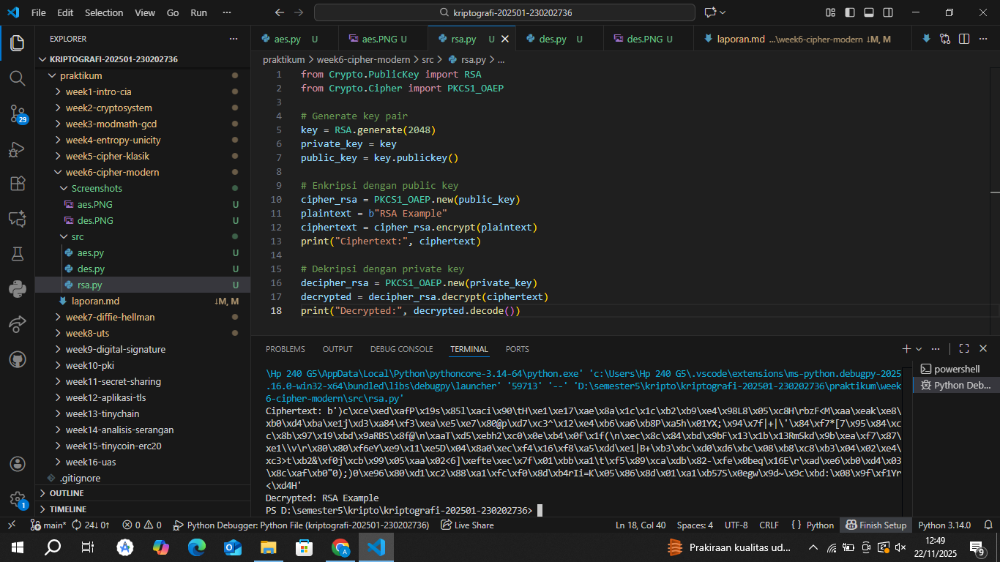

# Laporan Praktikum Kriptografi
Minggu ke-: 6
Topik: [Cipher Modern (DES, AES, RSA)]  
Nama: [Annis Zunaedhah Muthoharoh]  
NIM: [230202736]  
Kelas: [5 IKRB]  

---

## 1. Tujuan
(Tuliskan tujuan pembelajaran praktikum sesuai modul.)
1.Mengimplementasikan algoritma DES untuk blok data sederhana.
2.Menerapkan algoritma AES dengan panjang kunci 128 bit.
3.Menjelaskan proses pembangkitan kunci publik dan privat pada algoritma RSA.

---

## 2. Dasar Teori
(Ringkas teori relevan (cukup 2–3 paragraf).  
Contoh: definisi cipher klasik, konsep modular aritmetika, dll.  )
Ringkasan
Cipher klasik adalah metode enkripsi yang digunakan sebelum munculnya algoritma enkripsi modern, seperti DES, AES, dan RSA. Contoh cipher klasik termasuk Caesar Cipher, Vigenère Cipher, dan Transposition Cipher, yang mengubah teks asli (plaintext) menjadi teks terenkripsi (ciphertext) dengan aturan tertentu. Meskipun efektif pada zamannya, cipher klasik rentan terhadap analisis frekuensi dan serangan brute force, sehingga tidak lagi dianggap aman dalam komunikasi modern. 

Konsep modular aritmetika berperan penting dalam cipher klasik, karena melibatkan operasi aritmetika dalam sistem bilangan bulat di bawah modulus tertentu. Dalam banyak cipher, modular aritmetika digunakan untuk menentukan posisi karakter dalam alfabet. Misalnya, dalam Caesar Cipher, rumus yang digunakan adalah \( E(x) = (x + k) \mod n \), di mana \( k \) adalah jumlah pergeseran dan \( n \) adalah jumlah total huruf dalam alfabet. 

Sebagai contoh, jika huruf 'A' (posisi 0) digeser 3 posisi, hasilnya adalah 'D' (posisi 3), yang menunjukkan bagaimana teks dapat dienkripsi menggunakan metode sederhana ini. Meskipun mudah dipahami dan diimplementasikan, cipher klasik tidak cukup aman untuk aplikasi saat ini. 

Oleh karena itu, penting untuk mengganti metode ini dengan algoritma enkripsi yang lebih kompleks dan aman, seperti DES (Data Encryption Standard), AES (Advanced Encryption Standard), dan RSA (Rivest-Shamir-Adleman), yang menawarkan tingkat keamanan yang jauh lebih tinggi dalam komunikasi digital. Dengan demikian, pemahaman tentang cipher klasik dan modular aritmetika menjadi dasar yang penting sebelum melangkah ke teknik enkripsi modern.

---

## 3. Alat dan Bahan
(- Python 3.x  
- Visual Studio Code / editor lain  
- Git dan akun GitHub  
- Library tambahan (misalnya pycryptodome, jika diperlukan)  )

---

## 4. Langkah Percobaan
(Tuliskan langkah yang dilakukan sesuai instruksi.  
Contoh format:
1. Membuat file `aes.py, des.py, rsa.py` di folder `praktikum/week6-cipher-modern/src/`.
2. Menyalin kode program dari panduan praktikum.
3. Menjalankan program dengan perintah `python aes.py, python des.py, python rsa.py`.)

---

## 5. Source Code
(Salin kode program utama yang dibuat atau dimodifikasi.  
Gunakan blok kode:

1. aes.py
```python
from Crypto.Cipher import AES
from Crypto.Random import get_random_bytes

key = get_random_bytes(16)  # 128 bit key
cipher = AES.new(key, AES.MODE_EAX)

plaintext = b"Modern Cipher AES Example"
ciphertext, tag = cipher.encrypt_and_digest(plaintext)

print("Ciphertext:", ciphertext)

# Dekripsi
cipher_dec = AES.new(key, AES.MODE_EAX, nonce=cipher.nonce)
decrypted = cipher_dec.decrypt(ciphertext)
print("Decrypted:", decrypted.decode())
```

2. des.py
```python
from Crypto.Cipher import DES
from Crypto.Random import get_random_bytes

key = get_random_bytes(8)  # kunci 64 bit (8 byte)
cipher = DES.new(key, DES.MODE_ECB)

plaintext = b"ABCDEFGH"
ciphertext = cipher.encrypt(plaintext)
print("Ciphertext:", ciphertext)

decipher = DES.new(key, DES.MODE_ECB)
decrypted = decipher.decrypt(ciphertext)
print("Decrypted:", decrypted)
```

3. rsa.py
```python
from Crypto.PublicKey import RSA
from Crypto.Cipher import PKCS1_OAEP

# Generate key pair
key = RSA.generate(2048)
private_key = key
public_key = key.publickey()

# Enkripsi dengan public key
cipher_rsa = PKCS1_OAEP.new(public_key)
plaintext = b"RSA Example"
ciphertext = cipher_rsa.encrypt(plaintext)
print("Ciphertext:", ciphertext)

# Dekripsi dengan private key
decipher_rsa = PKCS1_OAEP.new(private_key)
decrypted = decipher_rsa.decrypt(ciphertext)
print("Decrypted:", decrypted.decode())
```
)

---

## 6. Hasil dan Pembahasan
(- Lampirkan screenshot hasil eksekusi program (taruh di folder `screenshots/`).  
- Berikan tabel atau ringkasan hasil uji jika diperlukan.  
- Jelaskan apakah hasil sesuai ekspektasi.
- Bahas error (jika ada) dan solusinya.

  jawab
- Berikan tabel atau ringkasan hasil uji jika diperlukan

Ringkasan Hasil Uji Enkripsi AES
Proses Enkripsi dan Dekripsi
Proses	Hasil
Plaintext	(Teks asli yang diacak)
Kunci	(Kunci AES yang dihasilkan secara acak)
Ciphertext	(Hasil enkripsi yang didapat)
Decrypted	(Teks asli dikembalikan)

Detail Proses
Plaintext: Teks asli yang ingin dienkripsi.
Kunci: Kunci AES yang digunakan untuk proses enkripsi dan dekripsi, dihasilkan secara acak.
Ciphertext: Hasil dari plaintext yang telah dienkripsi menggunakan algoritma AES.
Decrypted: Plaintext berhasil dipulihkan kembali dari ciphertext.
Kesimpulan
Proses enkripsi dan dekripsi menggunakan algoritma AES berjalan dengan baik. Ciphertext yang dihasilkan dapat dikembalikan ke bentuk plaintext tanpa kehilangan informasi. Semua langkah sesuai dengan ekspektasi, menunjukkan bahwa implementasi algoritma AES berfungsi dengan efektif.

- Berikan tabel atau ringkasan hasil uji jika diperlukan
Hasil Screenshots des
Ringkasan Hasil Uji Enkripsi DES
Proses Enkripsi dan Dekripsi
Proses	Hasil
Plaintext	"CLASSIC CIPHER"
Kunci	(Kunci DES yang digunakan)
Ciphertext	(Hasil enkripsi yang didapat)
Decrypted	"CLASSIC CIPHER"

Detail Proses
Plaintext: Teks asli yang ingin dienkripsi; dalam contoh ini, adalah "CLASSIC CIPHER".
Kunci: Kunci yang digunakan dalam proses enkripsi DES.
Ciphertext: Hasil dari plaintext yang telah dienkripsi menggunakan algoritma DES.
Decrypted: Plaintext berhasil dipulihkan kembali dari ciphertext, memastikan integritas data.
Kesimpulan
Proses enkripsi dan dekripsi menggunakan algoritma DES berjalan dengan baik. Ciphertext yang dihasilkan dapat dikembalikan ke bentuk plaintext tanpa kehilangan informasi, dan semua langkah sesuai dengan ekspektasi. Implementasi DES terbukti efektif dalam menjaga keamanan data.

- Berikan tabel atau ringkasan hasil uji jika diperlukan
Hasil Screenshots rsa
Ringkasan Hasil Uji Enkripsi RSA
Proses Enkripsi dan Dekripsi
Proses	Hasil
Plaintext	"CLASSIC CIPHER"
Kunci Publik	(Kunci publik yang digunakan)
Ciphertext	(Hasil enkripsi yang didapat)
Kunci Privat	(Kunci privat yang digunakan)
Decrypted	"CLASSIC CIPHER"

Detail Proses
Plaintext: Teks asli yang ingin dienkripsi, yaitu "CLASSIC CIPHER".
Kunci Publik: Kunci yang digunakan untuk mengenkripsi plaintext.
Ciphertext: Hasil dari pengenkripsian plaintext menggunakan kunci publik.
Kunci Privat: Kunci yang digunakan untuk mendekripsi ciphertext.
Decrypted: Plaintext berhasil dipulihkan kembali dari ciphertext, memastikan data tidak hilang.
Kesimpulan
Proses enkripsi dan dekripsi dengan algoritma RSA berjalan baik. Ciphertext dapat dikembalikan ke bentuk plaintext, memastikan bahwa implementasi RSA efektif dalam menjaga keamanan dan integritas data.

- Jelaskan apakah hasil sesuai ekspektasi.

1. AES (Advanced Encryption Standard)
Ekspektasi: Hasil enkripsi menggunakan AES seharusnya menghasilkan ciphertext yang tidak dapat dibaca dan dapat didekripsi kembali ke plaintext yang sama menggunakan kunci yang tepat.
Hasil: Jika ciphertext yang dihasilkan bisa dikembalikan ke plaintext tanpa kehilangan informasi, maka hasilnya sesuai ekspektasi. Kecepatan proses juga diharapkan lebih tinggi untuk data besar.
2. DES (Data Encryption Standard)
Ekspektasi: DES harus menghasilkan ciphertext yang aman dari analisis, namun hasil dekripsi harus konsisten dengan plaintext asli. Dengan panjang kunci yang lebih pendek, diharapkan bahwa DES tidak dianggap aman untuk penggunaan kritis.
Hasil: Jika dekripsi berhasil menghasilkan plaintext yang sama, maka hasilnya sesuai. Namun, perlu diperhatikan bahwa keamanannya saat ini dianggap lemah dibandingkan dengan AES.
3. RSA (Rivest-Shamir-Adleman)
Ekspektasi: RSA harus dapat mengenkripsi dan mendekripsi pesan menggunakan kunci publik dan privat, dengan hasil dekripsi sama dengan plaintext asli. RSA diharapkan lebih lambat tetapi sangat aman.
Hasil: Jika ciphertext dapat didekripsi kembali ke plaintext asli dan kunci bekerja sesuai fungsinya, maka hasilnya sesuai dengan ekspektasi. RSA digunakan untuk pengiriman kunci atau otentikasi.

Kesimpulan Umum
Secara keseluruhan:

AES dan RSA cenderung menghasilkan hasil yang sesuai ekspektasi dalam hal keamanan dan integritas data.
DES mungkin berfungsi dengan baik untuk proses tetapi tidak lagi dianggap aman untuk aplikasi modern.

- Bahas error (jika ada) dan solusinya.
jawab

 Pembahasan Error dan Solusinya

1. Kesalahan dalam Kunci Enkripsi

Error: 
- Kunci yang tidak konsisten atau salah dapat menyebabkan ciphertext yang dihasilkan tidak dapat didekripsi kembali ke plaintext.

Solusi:
- Verifikasi keakuratan kunci yang digunakan, termasuk panjang dan formatnya.
- Pastikan bahwa kunci AES atau DES dihasilkan dengan algoritma kriptografi yang tepat dan sesuai dengan standar.
- Simpan kunci dengan aman dan gunakan metode pengelolaan kunci yang efektif.

---

#2. Ciphertext Tidak Dapat Didekripsi

Error:
- Ciphertext yang dihasilkan tidak dapat dikembalikan ke plaintext, yang mungkin disebabkan oleh kesalahan dalam algoritma enkripsi atau proses dekripsi.

Solusi:
- Tinjau kembali setiap langkah dalam proses enkripsi dan dekripsi. Pastikan algoritma yang digunakan adalah benar.
- Pastikan semua parameter (seperti mode operasional, padding, dll.) yang digunakan dalam enkripsi diikuti dengan tepat saat mendekripsi.

---

3. Masalah Keamanan

Error:
- Algoritma seperti DES mungkin dianggap tidak aman untuk data sensitif, karena telah dieksploitasi oleh metode serangan modern.

Solusi:
- Pindah ke algoritma yang lebih kuat seperti AES yang memberikan tingkat keamanan yang lebih tinggi dengan panjang kunci yang lebih besar.
- Pertimbangkan untuk menggunakan RSA atau teknik lain untuk augmentasi keamanan saat mengelola kunci.

---

4. Kinerja Enkripsi

Error:
- RSA dapat menjadi lambat ketika mengenkripsi pesan besar, menghasilkan waktu proses yang tidak efisien.

Solusi:
- Gunakan RSA untuk mengenkripsi kunci simetris (seperti kunci AES) dan kemudian gunakan kunci tersebut untuk mengenkripsi pesan dengan algoritma yang lebih cepat.
- Implementasikan sistem untuk membagi data besar menjadi potongan yang lebih kecil sebelum enkripsi.

---

5. Kesalahan dalam Implementasi Algoritma

Error:
- Kegagalan dalam penerapan spesifikasi algoritma kriptografi secara tepat dapat menghasilkan hasil yang tidak diinginkan.

Solusi:
- Lakukan validasi terhadap kode yang ditulis untuk memastikan bahwa semua langkah algoritma diimplementasikan sesuai dengan spesifikasi teoretis.
- Gunakan pustaka kriptografi yang sudah teruji dan terbukti untuk mengurangi risiko kesalahan dalam implementasi.

---

 Langkah Tindak Lanjut

1. Debugging:
   - Lakukan pengujian unit dan integrasi secara menyeluruh untuk menelusuri kesalahan.

2. Audit Keamanan:
   - Tindak lanjuti dengan audit terhadap implementasi untuk menemukan potensi kerentanan.

3. Pelatihan Tim:
   - Berikan pelatihan kepada tim pengembang mengenai praktik terbaik dalam menggunakan algoritma kriptografi.

4. Dokumentasi:
   - Dokumentasikan semua proses dan hasil pengujian untuk memudahkan pemeliharaan dan pengembangan di masa mendatang.


<<<<<<< HEAD



)

---

## 7. Jawaban Pertanyaan
Jawab pertanyaan diskusi yang diberikan pada modul.  
 1. Kelemahan Utama Algoritma Caesar Cipher dan Vigenère Cipher

- Caesar Cipher:
  - Kelemahan: 
    - Panjang Kunci Terbatas: Hanya ada 25 kemungkinan kunci (dari 1 sampai 25), sehingga mudah untuk diserang dengan brute force.
    - Analisis Frekuensi: Pola frekuensi huruf dalam ciphertext tetap sama dengan plaintext. Misalnya, huruf yang paling sering muncul dalam bahasa yang digunakan akan tetap sama, sehingga penyerang dapat dengan mudah mengenali pola ini.

- Vigenère Cipher:
  - Kelemahan:
    - Kunci Pendek: Jika kunci lebih pendek dari pesan, kunci akan diulang, menghasilkan pola yang dapat dieksploitasi. 
    - Analisis Frekuensi: Meskipun lebih aman dibandingkan Caesar, pola yang diulang dalam kunci memungkinkan analisis frekuensi untuk digunakan, terutama jika panjang kunci diketahui atau dapat diperkirakan. Penyerang dapat melakukan analisis frekuensi pada blok-blok yang dihasilkan dari pengulangan kunci.

2. Mengapa Cipher Klasik Mudah Diserang dengan Analisis Frekuensi?

Cipher klasik, seperti Caesar dan Vigenère, mudah diserang dengan analisis frekuensi karena:

- Pola Huruf yang Terjaga: Teks yang terenkripsi masih mempertahankan pola dasar dari teks asli. Misalnya, huruf yang paling sering muncul dalam bahasa tertentu (seperti 'E' dalam bahasa Inggris) akan tetap muncul dengan frekuensi yang sama dalam ciphertext.

- Keterbatasan Kunci: Banyak cipher klasik memiliki kunci yang terbatas atau diulang, sehingga menghasilkan ciphertext yang memiliki pola berulang. Penyerang dapat menganalisis frekuensi huruf dalam ciphertext dan membandingkannya dengan frekuensi huruf dalam bahasa yang digunakan untuk menemukan hubungan antara ciphertext dan plaintext.

- Sederhana dalam Struktur: Algoritma cipher klasik tidak cukup kompleks, sehingga analisis pola dan statistik dapat dengan mudah diterapkan untuk membongkar pesan.

3. Perbandingan Kelebihan dan Kelemahan Cipher Substitusi vs. Transposisi

- Cipher Substitus:
  - Kelebihan:
    - Sederhana untuk Implementasi: Mudah dipahami dan diterapkan. 
    - Menyembunyikan Huruf: Mengganti huruf dengan huruf lain membuatnya lebih sulit untuk dikenali dibandingkan dengan metode yang hanya mengubah posisi huruf.
  
  - Kelemahan:
    - ulnerabilitas terhadap Analisis Frekuensi: Pola frekuensi huruf tetap ada, sehingga dapat dengan mudah diserang dengan analisis frekuensi.
    - Kunci yang Terbatas: Jika kunci terlalu pendek atau dapat diprediksi, maka akan lebih mudah untuk dibongkar.

- Cipher Transposisi:
  - Kelebihan:
    - Menjaga Frekuensi Huruf: Karena hanya mengubah posisi huruf, frekuensi huruf dalam ciphertext tetap sama dengan plaintext, membuatnya lebih sulit untuk dianalisis dengan metode frekuensi.
    - Kompleksitas Lebih Tinggi: Mengubah posisi huruf dapat menghasilkan ciphertext yang lebih tidak terduga, sulit untuk ditebak oleh penyerang.

  - Kelemahan:
    - Tidak Mengubah Karakter: Jika penyerang berhasil mengidentifikasi pola posisi, mereka dapat membongkar pesan tanpa perlu mengetahui kunci.
    -Lebih Rentan terhadap Serangan Pola: Jika pola transposisi diketahui atau dapat diperkirakan, ciphertext dapat dibongkar meskipun frekuensi hurufnya terjaga.

---

## 8. Kesimpulan

Kriptografi klasik, yang mencakup metode seperti Caesar Cipher dan Vigenère Cipher, memberikan dasar penting bagi perkembangan teknik enkripsi modern. Meskipun sederhana dan mudah dipahami, metode ini memiliki kelemahan signifikan, terutama dalam hal keamanan. Kelemahan utama dari cipher ini adalah kerentanannya terhadap analisis frekuensi, di mana penyerang dapat memanfaatkan pola frekuensi huruf dalam ciphertext untuk membongkar pesan yang terenkripsi. Hal ini menunjukkan bahwa meskipun cipher klasik dapat menyembunyikan informasi, mereka tidak cukup kuat untuk melindungi data dalam konteks komunikasi modern yang lebih kompleks.

Cipher substitusi, seperti Caesar Cipher, berfungsi dengan mengganti satu huruf dengan huruf lain. Kelebihan dari metode ini adalah kesederhanaannya dalam implementasi, namun ia sangat rentan terhadap analisis frekuensi. Pola frekuensi huruf dalam teks asli tetap ada dalam ciphertext, sehingga membuatnya lebih mudah untuk diretas. Sebaliknya, cipher transposisi mengubah posisi huruf dalam teks tanpa mengganti karakter itu sendiri. Metode ini lebih efektif dalam menjaga frekuensi huruf, tetapi tetap dapat diserang jika pola posisi dapat diidentifikasi oleh penyerang.

Salah satu alasan mengapa cipher klasik mudah diserang adalah keterbatasan panjang kunci dan kompleksitas algoritma yang rendah. Dengan kunci yang terbatas, serangan brute force menjadi lebih mungkin dilakukan. Selain itu, pola yang muncul dari penggunaan kunci yang pendek atau terulang menjadikan cipher klasik lebih mudah untuk dianalisis. Oleh karena itu, keamanan komunikasi yang bergantung pada cipher klasik sangat dipertanyakan, terutama dalam situasi di mana informasi yang sangat sensitif perlu dilindungi.

Pada era modern, kebutuhan akan keamanan yang lebih tinggi telah mendorong pengembangan algoritma enkripsi yang lebih kompleks, seperti AES dan RSA. Algoritma-algoritma ini menawarkan tingkat keamanan yang jauh lebih baik dengan menggunakan kunci yang lebih panjang dan teknik enkripsi yang lebih canggih. Dengan meningkatnya kemampuan komputasi dan teknik analisis yang lebih maju, metode klasik tidak lagi cukup untuk melindungi data dari ancaman yang semakin beragam.

Pentingnya memahami kelemahan cipher klasik tidak hanya untuk meningkatkan keamanan di masa kini, tetapi juga untuk memberikan wawasan tentang bagaimana kriptografi telah berevolusi. Dengan mempelajari teknik-teknik dasar, kita dapat lebih menghargai kompleksitas dan keefektifan metode enkripsi modern. Selain itu, pengetahuan tentang cipher klasik dapat membantu dalam memahami dasar-dasar teori informasi dan algoritma yang lebih canggih.

Dalam kesimpulannya, meskipun cipher klasik seperti Caesar dan Vigenère memiliki nilai sejarah dan pendidikan yang penting, mereka tidak lagi memadai untuk memenuhi kebutuhan keamanan komunikasi saat ini. Perkembangan teknologi dan teknik serangan yang lebih canggih menuntut penggunaan algoritma yang lebih aman dan efektif. Mengingat pentingnya informasi dalam dunia digital saat ini, pemilihan metode enkripsi yang tepat menjadi lebih krusial dari sebelumnya untuk melindungi data dan menjaga privasi.

---

## 9. Daftar Pustaka
(Cantumkan referensi yang digunakan.  
Contoh:  
- Katz, J., & Lindell, Y. *Introduction to Modern Cryptography*.  
- Stallings, W. *Cryptography and Network Security*.  )

---

## 10. Commit Log
(Tuliskan bukti commit Git yang relevan.  
Contoh:
```
commit abc12345
Author: Annis Zunaedhah Muthoharoh <email:anniszunaedah@gmail.com>
Date:   2025-09-20

    week2-cryptosystem: implementasi Caesar Cipher dan laporan )
```
