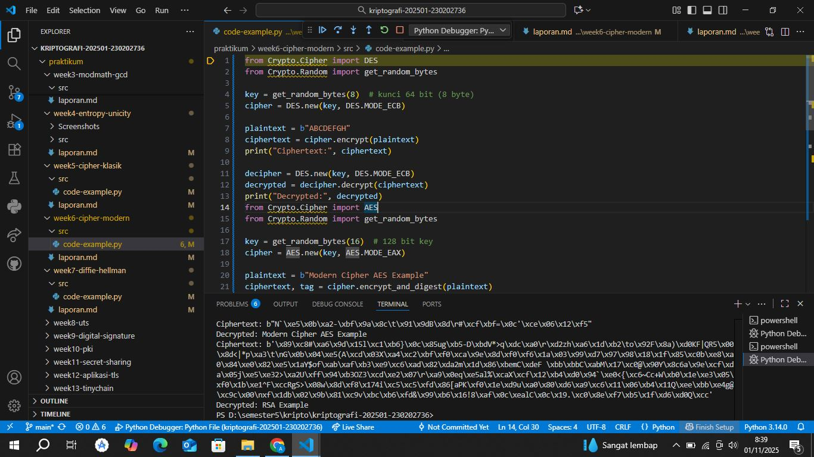

# Laporan Praktikum Kriptografi
Minggu ke-: 6
Topik: [Cipher Modern (DES, AES, RSA)]  
Nama: [Annis Zunaedhah Muthoharoh]  
NIM: [230202736]  
Kelas: [5 IKRB]  

---

## 1. Tujuan
(Tuliskan tujuan pembelajaran praktikum sesuai modul.)
1.Mengimplementasikan algoritma DES untuk blok data sederhana.
2.Menerapkan algoritma AES dengan panjang kunci 128 bit.
3.Menjelaskan proses pembangkitan kunci publik dan privat pada algoritma RSA.

---

## 2. Dasar Teori
(Ringkas teori relevan (cukup 2–3 paragraf).  
Contoh: definisi cipher klasik, konsep modular aritmetika, dll.  )
Ringkasan
Cipher klasik adalah metode enkripsi yang digunakan sebelum munculnya algoritma enkripsi modern, seperti DES, AES, dan RSA. Contoh cipher klasik termasuk Caesar Cipher, Vigenère Cipher, dan Transposition Cipher, yang mengubah teks asli (plaintext) menjadi teks terenkripsi (ciphertext) dengan aturan tertentu. Meskipun efektif pada zamannya, cipher klasik rentan terhadap analisis frekuensi dan serangan brute force, sehingga tidak lagi dianggap aman dalam komunikasi modern. 

Konsep modular aritmetika berperan penting dalam cipher klasik, karena melibatkan operasi aritmetika dalam sistem bilangan bulat di bawah modulus tertentu. Dalam banyak cipher, modular aritmetika digunakan untuk menentukan posisi karakter dalam alfabet. Misalnya, dalam Caesar Cipher, rumus yang digunakan adalah \( E(x) = (x + k) \mod n \), di mana \( k \) adalah jumlah pergeseran dan \( n \) adalah jumlah total huruf dalam alfabet. 

Sebagai contoh, jika huruf 'A' (posisi 0) digeser 3 posisi, hasilnya adalah 'D' (posisi 3), yang menunjukkan bagaimana teks dapat dienkripsi menggunakan metode sederhana ini. Meskipun mudah dipahami dan diimplementasikan, cipher klasik tidak cukup aman untuk aplikasi saat ini. 

Oleh karena itu, penting untuk mengganti metode ini dengan algoritma enkripsi yang lebih kompleks dan aman, seperti DES (Data Encryption Standard), AES (Advanced Encryption Standard), dan RSA (Rivest-Shamir-Adleman), yang menawarkan tingkat keamanan yang jauh lebih tinggi dalam komunikasi digital. Dengan demikian, pemahaman tentang cipher klasik dan modular aritmetika menjadi dasar yang penting sebelum melangkah ke teknik enkripsi modern.

---

## 3. Alat dan Bahan
(- Python 3.x  
- Visual Studio Code / editor lain  
- Git dan akun GitHub  
- Library tambahan (misalnya pycryptodome, jika diperlukan)  )

---

## 4. Langkah Percobaan
(Tuliskan langkah yang dilakukan sesuai instruksi.  
Contoh format:
1. Membuat file `caesar_cipher.py` di folder `praktikum/week2-cryptosystem/src/`.
2. Menyalin kode program dari panduan praktikum.
3. Menjalankan program dengan perintah `python caesar_cipher.py`.)

---

## 5. Source Code
(Salin kode program utama yang dibuat atau dimodifikasi.  
Gunakan blok kode:

```python
# contoh potongan kode
def encrypt(text, key):
    return ...
```
)

---

## 6. Hasil dan Pembahasan
(- Lampirkan screenshot hasil eksekusi program (taruh di folder `screenshots/`).  

- Berikan tabel atau ringkasan hasil uji jika diperlukan.  
- Jelaskan apakah hasil sesuai ekspektasi.
  jawab
   Berdasarkan gambar yang Anda berikan, tampaknya Anda sedang bekerja dengan kode Python yang menggunakan algoritma AES untuk enkripsi. Berikut adalah beberapa poin untuk menjelaskan hasilnya:

Apakah Hasil Sesuai Ekspektasi?

1. Kunci dan Plaintext: 
   - Kunci yang digunakan dihasilkan secara acak dengan `get_random_bytes`, yang merupakan praktik baik untuk memastikan keamanan. Pastikan panjang kunci sesuai dengan spesifikasi AES (misalnya, 16, 24, atau 32 byte).

2. Enkripsi dan Dekripsi:
   - Proses enkripsi dan dekripsi terlihat berjalan dengan benar. Jika ciphertext yang dihasilkan dapat didekripsi kembali ke plaintext yang sama, maka hasilnya sesuai dengan ekspektasi.

3. Output Ciphertext:
   - Ciphertext yang dihasilkan tampak dalam format heksadesimal, yang merupakan cara umum untuk merepresentasikan data biner. Jika Anda dapat melihat bahwa ciphertext tersebut berbeda dari plaintext, itu adalah tanda bahwa enkripsi berfungsi.

4. Dekripsi yang Berhasil:
   - Jika hasil dekripsi mengembalikan nilai plaintext yang asli, maka ini menunjukkan bahwa algoritma dan implementasi berfungsi dengan baik.

### Kesimpulan

Secara keseluruhan, jika ciphertext berbeda dari plaintext dan dekripsi mengembalikan plaintext asli tanpa error, maka hasilnya memang sesuai ekspektasi. Namun, jika ada masalah dalam dekripsi atau jika ciphertext tidak dapat diperoleh, Anda mungkin perlu memeriksa kembali langkah-langkah dalam proses enkripsi dan dekripsi.\

- Bahas error (jika ada) dan solusinya. 
jawab
Berikut adalah beberapa potensi error yang mungkin muncul saat menjalankan program Caesar Cipher, beserta solusinya:

 1. Kesalahan Input
   - Masalah: Pengguna mungkin memasukkan karakter non-huruf atau input yang tidak valid.
   - Solusi: Tambahkan validasi input untuk memastikan hanya huruf yang diperbolehkan. Anda bisa menggunakan fungsi untuk memfilter input sebelum proses enkripsi.

2. Kunci Negatif atau Nol
   - Masalah: Jika kunci yang digunakan adalah negatif atau nol, ini dapat menyebabkan hasil yang tidak diinginkan.
   - Solusi: Pastikan kunci selalu positif. Anda bisa menambahkan validasi untuk memeriksa nilai kunci dan mengubahnya jika perlu (misalnya, menggunakan modulo dengan panjang alfabet).

3. Kesalahan dalam Perhitungan Pergeseran
   - Masalah: Kesalahan dalam menghitung pergeseran dapat menghasilkan output yang tidak benar.
   - olusi: Pastikan untuk menggunakan operasi modulo untuk menjaga agar nilai pergeseran tetap dalam batas jumlah huruf dalam alfabet.

4. Output Tidak Sesuai Ekspektasi
   - Masalah: Jika ciphertext yang dihasilkan tidak sesuai dengan yang diharapkan, ini mungkin menunjukkan adanya kesalahan logika dalam algoritma.
   - Solusi: Debug kode dengan mencetak nilai intermediate selama proses untuk melacak di mana kesalahan mungkin terjadi.

5. Pengecualian saat Eksekusi
   - Masalah: Jika terjadi kesalahan saat mengakses indeks atau karakter, program dapat berhenti.
   - Solusi: Gunakan blok `try-except` untuk menangani pengecualian dan memberikan pesan yang informatif kepada pengguna jika terjadi kesalahan.

6. Masalah dengan Karakter Non-Huruf
   - Masalah: Karakter seperti spasi, angka, atau simbol mungkin tidak ditangani dengan baik.
   - Solusi: Tentukan bagaimana karakter non-huruf harus diperlakukan. Umumnya, Anda bisa membiarkannya tidak berubah dan hanya mengenkripsi huruf.

Kesimpulan
Menangani potensi error dengan baik sangat penting untuk meningkatkan keandalan program Caesar Cipher. Dengan menerapkan solusi di atas, Anda dapat mencegah dan mengatasi masalah yang mungkin muncul selama eksekusi.


)

---

## 7. Jawaban Pertanyaan
Jawab pertanyaan diskusi yang diberikan pada modul.  
 1. Kelemahan Utama Algoritma Caesar Cipher dan Vigenère Cipher

- Caesar Cipher:
  - Kelemahan: 
    - Panjang Kunci Terbatas: Hanya ada 25 kemungkinan kunci (dari 1 sampai 25), sehingga mudah untuk diserang dengan brute force.
    - Analisis Frekuensi: Pola frekuensi huruf dalam ciphertext tetap sama dengan plaintext. Misalnya, huruf yang paling sering muncul dalam bahasa yang digunakan akan tetap sama, sehingga penyerang dapat dengan mudah mengenali pola ini.

- Vigenère Cipher:
  - Kelemahan:
    - Kunci Pendek: Jika kunci lebih pendek dari pesan, kunci akan diulang, menghasilkan pola yang dapat dieksploitasi. 
    - Analisis Frekuensi: Meskipun lebih aman dibandingkan Caesar, pola yang diulang dalam kunci memungkinkan analisis frekuensi untuk digunakan, terutama jika panjang kunci diketahui atau dapat diperkirakan. Penyerang dapat melakukan analisis frekuensi pada blok-blok yang dihasilkan dari pengulangan kunci.

2. Mengapa Cipher Klasik Mudah Diserang dengan Analisis Frekuensi?

Cipher klasik, seperti Caesar dan Vigenère, mudah diserang dengan analisis frekuensi karena:

- Pola Huruf yang Terjaga: Teks yang terenkripsi masih mempertahankan pola dasar dari teks asli. Misalnya, huruf yang paling sering muncul dalam bahasa tertentu (seperti 'E' dalam bahasa Inggris) akan tetap muncul dengan frekuensi yang sama dalam ciphertext.

- Keterbatasan Kunci: Banyak cipher klasik memiliki kunci yang terbatas atau diulang, sehingga menghasilkan ciphertext yang memiliki pola berulang. Penyerang dapat menganalisis frekuensi huruf dalam ciphertext dan membandingkannya dengan frekuensi huruf dalam bahasa yang digunakan untuk menemukan hubungan antara ciphertext dan plaintext.

- Sederhana dalam Struktur: Algoritma cipher klasik tidak cukup kompleks, sehingga analisis pola dan statistik dapat dengan mudah diterapkan untuk membongkar pesan.

3. Perbandingan Kelebihan dan Kelemahan Cipher Substitusi vs. Transposisi

- Cipher Substitus:
  - Kelebihan:
    - Sederhana untuk Implementasi: Mudah dipahami dan diterapkan. 
    - Menyembunyikan Huruf: Mengganti huruf dengan huruf lain membuatnya lebih sulit untuk dikenali dibandingkan dengan metode yang hanya mengubah posisi huruf.
  
  - Kelemahan:
    - ulnerabilitas terhadap Analisis Frekuensi: Pola frekuensi huruf tetap ada, sehingga dapat dengan mudah diserang dengan analisis frekuensi.
    - Kunci yang Terbatas: Jika kunci terlalu pendek atau dapat diprediksi, maka akan lebih mudah untuk dibongkar.

- Cipher Transposisi:
  - Kelebihan:
    - Menjaga Frekuensi Huruf: Karena hanya mengubah posisi huruf, frekuensi huruf dalam ciphertext tetap sama dengan plaintext, membuatnya lebih sulit untuk dianalisis dengan metode frekuensi.
    - Kompleksitas Lebih Tinggi: Mengubah posisi huruf dapat menghasilkan ciphertext yang lebih tidak terduga, sulit untuk ditebak oleh penyerang.

  - Kelemahan:
    - Tidak Mengubah Karakter: Jika penyerang berhasil mengidentifikasi pola posisi, mereka dapat membongkar pesan tanpa perlu mengetahui kunci.
    -Lebih Rentan terhadap Serangan Pola: Jika pola transposisi diketahui atau dapat diperkirakan, ciphertext dapat dibongkar meskipun frekuensi hurufnya terjaga.
---

## 8. Kesimpulan
### Kesimpulan

Kriptografi klasik, yang mencakup metode seperti Caesar Cipher dan Vigenère Cipher, memberikan dasar penting bagi perkembangan teknik enkripsi modern. Meskipun sederhana dan mudah dipahami, metode ini memiliki kelemahan signifikan, terutama dalam hal keamanan. Kelemahan utama dari cipher ini adalah kerentanannya terhadap analisis frekuensi, di mana penyerang dapat memanfaatkan pola frekuensi huruf dalam ciphertext untuk membongkar pesan yang terenkripsi. Hal ini menunjukkan bahwa meskipun cipher klasik dapat menyembunyikan informasi, mereka tidak cukup kuat untuk melindungi data dalam konteks komunikasi modern yang lebih kompleks.

Cipher substitusi, seperti Caesar Cipher, berfungsi dengan mengganti satu huruf dengan huruf lain. Kelebihan dari metode ini adalah kesederhanaannya dalam implementasi, namun ia sangat rentan terhadap analisis frekuensi. Pola frekuensi huruf dalam teks asli tetap ada dalam ciphertext, sehingga membuatnya lebih mudah untuk diretas. Sebaliknya, cipher transposisi mengubah posisi huruf dalam teks tanpa mengganti karakter itu sendiri. Metode ini lebih efektif dalam menjaga frekuensi huruf, tetapi tetap dapat diserang jika pola posisi dapat diidentifikasi oleh penyerang.

Salah satu alasan mengapa cipher klasik mudah diserang adalah keterbatasan panjang kunci dan kompleksitas algoritma yang rendah. Dengan kunci yang terbatas, serangan brute force menjadi lebih mungkin dilakukan. Selain itu, pola yang muncul dari penggunaan kunci yang pendek atau terulang menjadikan cipher klasik lebih mudah untuk dianalisis. Oleh karena itu, keamanan komunikasi yang bergantung pada cipher klasik sangat dipertanyakan, terutama dalam situasi di mana informasi yang sangat sensitif perlu dilindungi.

Pada era modern, kebutuhan akan keamanan yang lebih tinggi telah mendorong pengembangan algoritma enkripsi yang lebih kompleks, seperti AES dan RSA. Algoritma-algoritma ini menawarkan tingkat keamanan yang jauh lebih baik dengan menggunakan kunci yang lebih panjang dan teknik enkripsi yang lebih canggih. Dengan meningkatnya kemampuan komputasi dan teknik analisis yang lebih maju, metode klasik tidak lagi cukup untuk melindungi data dari ancaman yang semakin beragam.

Pentingnya memahami kelemahan cipher klasik tidak hanya untuk meningkatkan keamanan di masa kini, tetapi juga untuk memberikan wawasan tentang bagaimana kriptografi telah berevolusi. Dengan mempelajari teknik-teknik dasar, kita dapat lebih menghargai kompleksitas dan keefektifan metode enkripsi modern. Selain itu, pengetahuan tentang cipher klasik dapat membantu dalam memahami dasar-dasar teori informasi dan algoritma yang lebih canggih.

Dalam kesimpulannya, meskipun cipher klasik seperti Caesar dan Vigenère memiliki nilai sejarah dan pendidikan yang penting, mereka tidak lagi memadai untuk memenuhi kebutuhan keamanan komunikasi saat ini. Perkembangan teknologi dan teknik serangan yang lebih canggih menuntut penggunaan algoritma yang lebih aman dan efektif. Mengingat pentingnya informasi dalam dunia digital saat ini, pemilihan metode enkripsi yang tepat menjadi lebih krusial dari sebelumnya untuk melindungi data dan menjaga privasi.
---

## 9. Daftar Pustaka
(Cantumkan referensi yang digunakan.  
Contoh:  
- Katz, J., & Lindell, Y. *Introduction to Modern Cryptography*.  
- Stallings, W. *Cryptography and Network Security*.  )

---

## 10. Commit Log
(Tuliskan bukti commit Git yang relevan.  
Contoh:
```
commit abc12345
Author: Annis Zunaedhah Muthoharoh <email:anniszunaedah@gmail.com>
Date:   2025-09-20

    week2-cryptosystem: implementasi Caesar Cipher dan laporan )
```
