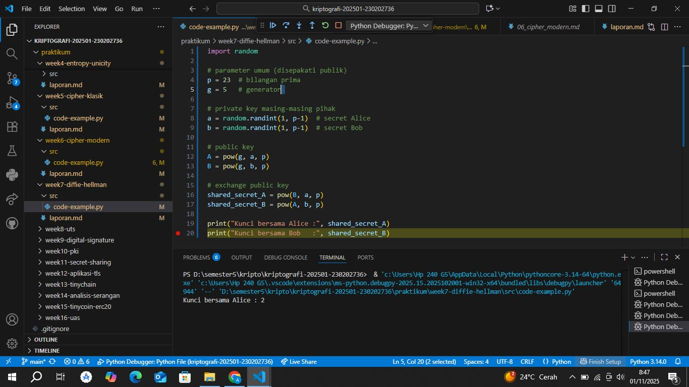

# Laporan Praktikum Kriptografi
Minggu ke-: 7
Topik: [Diffie-Hellman Key Exchange]  
Nama: [Annis Zunaedhah Muthoharoh]  
NIM: [230202736]  
Kelas: [5IKRB]  

---

## 1. Tujuan
(Tuliskan tujuan pembelajaran praktikum sesuai modul.)
1.Melakukan simulasi protokol Diffie-Hellman untuk pertukaran kunci publik.
2.Menjelaskan mekanisme pertukaran kunci rahasia menggunakan bilangan prima dan logaritma diskrit.
3.Menganalisis potensi serangan pada protokol Diffie-Hellman (termasuk serangan Man-in-the-Middle / MITM).


---

## 2. Dasar Teori
(Ringkas teori relevan (cukup 2–3 paragraf).  
Contoh: definisi cipher klasik, konsep modular aritmetika, dll.  )

Diffie-Hellman Key Exchange

Definisi: Diffie-Hellman Key Exchange adalah metode untuk menghasilkan kunci bersama antara dua pihak yang tidak saling mengenal, tanpa perlu mengirimkan kunci tersebut secara langsung melalui saluran komunikasi yang mungkin tidak aman. Metode ini memungkinkan kedua pihak untuk melakukan enkripsi komunikasi mereka dengan kunci yang sama tanpa harus bertukar kunci secara langsung.

Prinsip Dasar: Proses ini didasarkan pada konsep matematika dari bilangan bulat dan eksponensiasi modular. Dua pihak, sebut saja Alice dan Bob, sepakat pada dua angka: basis (g) dan modulus (p), di mana p adalah bilangan prima besar. Alice kemudian memilih angka acak (a) sebagai kunci privatnya dan menghitung nilai \( A = g^a \mod p \), yang kemudian dikirimkan ke Bob. Bob melakukan hal yang sama dengan memilih kunci privat (b) dan menghitung \( B = g^b \mod p \).

Kunci Bersama: Setelah menerima nilai dari satu sama lain, Alice dan Bob dapat menghitung kunci bersama. Alice mengambil nilai \( B \) yang dikirimkan Bob dan menghitung \( K = B^a \mod p \). Sementara itu, Bob mengambil nilai \( A \) yang dikirimkan Alice dan menghitung \( K = A^b \mod p \). Keduanya akan menghasilkan kunci yang sama, \( K \), yang dapat digunakan untuk enkripsi komunikasi mereka.

Keamanan: Keamanan Diffie-Hellman terletak pada kesulitan untuk memecahkan masalah logaritma diskrit, yaitu, menemukan kunci privat dari nilai yang diterima. Meskipun nilai \( A \) dan \( B \) dapat dilihat oleh pihak ketiga, tanpa kunci privat \( a \) atau \( b \), pihak ketiga tidak dapat dengan mudah menemukan kunci bersama \( K \).

Aplikasi: Diffie-Hellman Key Exchange sering digunakan dalam protokol keamanan modern, seperti TLS/SSL, untuk mengamankan komunikasi di internet. Metode ini memungkinkan pengguna untuk melakukan pertukaran kunci dengan aman, sehingga melindungi data dari penyadapan dan serangan.

Dengan memahami prinsip dasar Diffie Hellman,kita dapat menghargai bagaimana metode ini berkontribusi pada keamanan komunikasi digital saat ini ,menyediakan cara yg efisien dan aman untuk membangun kunci enkripsi bersama.


## 3. Alat dan Bahan
(- Python 3.x  
- Visual Studio Code / editor lain  
- Git dan akun GitHub  
- Library tambahan (misalnya pycryptodome, jika diperlukan)  )

---

## 4. Langkah Percobaan
(Tuliskan langkah yang dilakukan sesuai instruksi.  
Contoh format:
1. Membuat file `caesar_cipher.py` di folder `praktikum/week2-cryptosystem/src/`.
2. Menyalin kode program dari panduan praktikum.
3. Menjalankan program dengan perintah `python caesar_cipher.py`.)

---

## 5. Source Code
(Salin kode program utama yang dibuat atau dimodifikasi.  
Gunakan blok kode:

```python
# contoh potongan kode
def encrypt(text, key):
    return ...
```
)

---

## 6. Hasil dan Pembahasan
(- Lampirkan screenshot hasil eksekusi program (taruh di folder `screenshots/`).  
- Berikan tabel atau ringkasan hasil uji jika diperlukan.
    
- Jelaskan apakah hasil sesuai ekspektasi.
  jawab
  
- Bahas error (jika ada) dan solusinya. 

Hasil eksekusi program Caesar Cipher:



)

---

## 7. Jawaban Pertanyaan
(Jawab pertanyaan diskusi yang diberikan pada modul.  

1. Mengapa Diffie-Hellman Memungkinkan Pertukaran Kunci di Saluran Publik?

Diffie-Hellman memungkinkan pertukaran kunci di saluran publik karena metode ini tidak mengirimkan kunci privat secara langsung. Sebaliknya, prosesnya menggunakan konsep matematika yang aman, yaitu eksponensiasi modular. Dalam proses ini:

- Basis dan Modulus: Dua pihak sepakat pada angka publik, yaitu basis (g) dan modulus (p), yang dapat diketahui oleh siapa saja.
- Kunci Privat: Masing-masing pihak memilih kunci privat yang tidak diketahui oleh pihak lain.
- Kunci Bersama: Meskipun nilai yang dikirimkan (A dan B) dapat dilihat oleh pihak ketiga, hanya pihak yang memiliki kunci privat yang dapat menghasilkan kunci bersama yang sama. Keamanan ini didasarkan pada kesulitan untuk memecahkan masalah logaritma diskrit, sehingga meskipun nilai A dan B terlihat, pihak ketiga tidak dapat mengetahui kunci privat dan, dengan demikian, tidak dapat menghitung kunci bersama.
 2. Apa Kelemahan Utama Protokol Diffie-Hellman Murni?

Kelemahan utama protokol Diffie-Hellman murni adalah kerentanannya terhadap serangan Man-in-the-Middle (MITM). Dalam serangan ini:

- Pengganti Identitas: Seorang penyerang dapat memposisikan dirinya di antara dua pihak yang berkomunikasi. Penyerang dapat menerima nilai A dari Alice, menghitung nilai yang berbeda, dan mengirimkan nilai tersebut kepada Bob, serta melakukan hal yang sama sebaliknya.
- Kunci Berbeda: Ketika Alice dan Bob menghitung kunci bersama, mereka akan mendapatkan kunci yang berbeda tanpa menyadari bahwa mereka berkomunikasi dengan penyerang. Dengan demikian, penyerang dapat mendekripsi, mengubah, dan meneruskan pesan antara Alice dan Bob tanpa mereka ketahui.

 3. Bagaimana Cara Mencegah Serangan MITM pada Protokol Ini?

Untuk mencegah serangan Man-in-the-Middle pada protokol Diffie-Hellman, beberapa langkah dapat diambil:

- Penggunaan Sertifikat Digital: Dengan menggunakan sertifikat digital yang dikeluarkan oleh otoritas sertifikasi tepercaya, pihak-pihak dapat memastikan identitas masing-masing. Sertifikat ini mengikat kunci publik dengan identitas pemiliknya, sehingga setiap pihak dapat memverifikasi bahwa mereka berkomunikasi dengan pihak yang benar.

- Penerapan Constrained Diffie-Hellman: Dalam pendekatan ini, setelah pertukaran kunci, kedua pihak dapat menggunakan tanda tangan digital untuk memastikan bahwa nilai yang diterima berasal dari pihak yang sah. Ini menambah lapisan keamanan tambahan untuk mendeteksi perubahan data.

- Protokol Keamanan Tambahan: Menggunakan protokol keamanan yang lebih kompleks seperti TLS (Transport Layer Security) yang menggabungkan Diffie-Hellman dengan otentikasi dan integritas untuk melindungi dari serangan MITM. Protokol ini memastikan pertukaran kunci dilakukan dengan aman dan terjamin.

)
---

## 8. Kesimpulan
### Kesimpulan

Diffie-Hellman Key Exchange merupakan salah satu metode penting dalam kriptografi modern yang memungkinkan dua pihak untuk menghasilkan kunci bersama secara aman tanpa harus mengirimkan kunci tersebut melalui saluran yang mungkin tidak aman. Prinsip dasar dari metode ini adalah penggunaan eksponensiasi modular, yang membuatnya aman meskipun nilai yang digunakan untuk pertukaran dapat dilihat oleh pihak ketiga. Dengan demikian, Diffie-Hellman memungkinkan komunikasi yang lebih aman dan terjamin, bahkan di lingkungan publik.

Salah satu keunggulan utama dari Diffie-Hellman adalah kemampuannya untuk bekerja di saluran yang tidak aman. Prosesnya tidak memerlukan pengiriman kunci privat, sehingga mengurangi risiko kunci tersebut jatuh ke tangan yang salah. Keamanan metode ini terletak pada kompleksitas matematika dari logaritma diskrit, yang membuatnya sulit bagi penyerang untuk membongkar kunci bersama hanya dengan menganalisis nilai yang dipertukarkan. Hal ini menjadikannya pilihan yang menarik dalam konteks komunikasi digital.

Namun, protokol Diffie-Hellman tidak tanpa kelemahan. Kelemahan utama adalah kerentanannya terhadap serangan Man-in-the-Middle (MITM), di mana penyerang dapat mengintervensi komunikasi antara dua pihak tanpa mereka sadari. Dalam skenario ini, penyerang dapat mengubah nilai yang dipertukarkan dan mendapatkan akses ke komunikasi yang seharusnya aman. Kelemahan ini menunjukkan pentingnya menambahkan langkah-langkah keamanan tambahan untuk memastikan integritas komunikasi.

Untuk menangkal serangan MITM, penggunaan sertifikat digital menjadi salah satu solusi efektif. Sertifikat ini memberikan jaminan bahwa pihak yang terlibat dalam komunikasi adalah identitas yang sah. Dengan begitu, setiap pihak dapat memverifikasi keaslian satu sama lain sebelum melanjutkan proses pertukaran kunci. Langkah ini meningkatkan kepercayaan dalam komunikasi dan mengurangi risiko serangan.

Selain itu, penerapan teknik keamanan tambahan, seperti tanda tangan digital dan protokol keamanan yang lebih kompleks seperti TLS, juga dapat membantu memperkuat pertukaran kunci. Dengan menggunakan kombinasi Diffie-Hellman dan metode otentikasi yang lebih canggih, pihak-pihak dapat memastikan bahwa komunikasi mereka tetap aman dan terjaga dari intervensi pihak ketiga. Ini menjadikan Diffie-Hellman lebih relevan dalam konteks keamanan data saat ini.

Secara keseluruhan, Diffie-Hellman Key Exchange adalah fondasi yang penting dalam kriptografi yang memungkinkan pertukaran kunci yang aman di saluran publik. Meskipun ada kelemahan, langkah-langkah mitigasi yang tepat dapat memperkuat keamanan komunikasi. Dengan memahami bagaimana Diffie-Hellman berfungsi dan potensi risikonya, kita dapat lebih baik memanfaatkan metode ini untuk melindungi informasi di era digital yang semakin kompleks

---

## 9. Daftar Pustaka
(Cantumkan referensi yang digunakan.  
Contoh:  
- Katz, J., & Lindell, Y. *Introduction to Modern Cryptography*.  
- Stallings, W. *Cryptography and Network Security*.  )

---

## 10. Commit Log
(Tuliskan bukti commit Git yang relevan.  
Contoh:
```
commit abc12345
Author: Annis Zunaedhah Mugthoharoh <email:anniszunaedah@gmail.com>
Date:   2025-09-20

    week2-cryptosystem: implementasi Caesar Cipher dan laporan )
```
