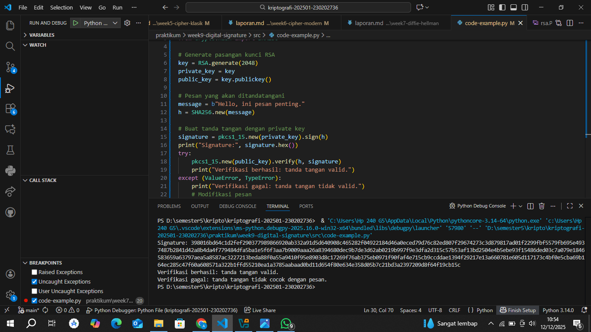

# Laporan Praktikum Kriptografi
Minggu ke-: 9 
Topik: [Digital Signature (RSA/DSA)]  
Nama: [Annis Zunaedhah Muthoharoh]  
NIM: [230202736]  
Kelas: [5 IKRB]  

---

## 1. Tujuan
(Tuliskan tujuan pembelajaran praktikum sesuai modul.)
1.Mengimplementasikan tanda tangan digital menggunakan algoritma RSA/DSA.
2.Memverifikasi keaslian tanda tangan digital.
3.Menjelaskan manfaat tanda tangan digital dalam otentikasi pesan dan integritas data.
---

## 2. Dasar Teori
(Ringkas teori relevan (cukup 2–3 paragraf).  
Contoh: definisi cipher klasik, konsep modular aritmetika, dll.  )
Teori Digital Signature (Tanda Tangan Digital)

Tanda tangan digital adalah metode kriptografi yang digunakan untuk memastikan keaslian dan integritas informasi. Dalam konteks algoritma RSA (Rivest-Shamir-Adleman) dan DSA (Digital Signature Algorithm), tanda tangan digital berfungsi sebagai bukti otentik bahwa pesan atau dokumen berasal dari pengirim tertentu dan belum mengalami perubahan selama transmisi. Proses ini melibatkan penggunaan kunci publik dan kunci privat, di mana kunci privat digunakan untuk membuat tanda tangan, dan kunci publik digunakan untuk memverifikasi tanda tangan tersebut.

Algoritma RSA beroperasi berdasarkan prinsip kesulitan dalam memfaktorisasi bilangan bulat besar. Sebelum membuat tanda tangan, pengirim akan membuat hash dari pesan menggunakan fungsi hash kriptografi, yang menghasilkan nilai tetap. Nilai hash ini kemudian dienkripsi menggunakan kunci privat pengirim untuk menghasilkan tanda tangan digital. Penerima dapat memverifikasi tanda tangan tersebut dengan mendekripsi menggunakan kunci publik pengirim dan membandingkannya dengan hash asli dari pesan. Metode ini menjamin bahwa hanya pemilik kunci privat yang dapat menghasilkan tanda tangan yang valid, sehingga keamanan dan keaslian pesan terjaga.

Di sisi lain, DSA adalah algoritma yang dirancang khusus untuk menghasilkan tanda tangan digital yang efisien. DSA menggunakan konsep bilangan bulat moduler dan aritmetika grup untuk memperkuat keamanan tanda tangan. Meskipun prinsip dasar dari DSA mirip dengan RSA, ia menawarkan efisiensi waktu dan ukuran tanda tangan yang lebih baik, menjadikannya pilihan yang populer untuk aplikasi digital. Dengan menggunakan DSA, pengguna dapat menjamin bahwa pesan yang diterima benar-benar berasal dari pengirim yang dimaksud dan tidak mengalami modifikasi.

---

## 3. Alat dan Bahan
(- Python 3.x  
- Visual Studio Code / editor lain  
- Git dan akun GitHub  
- Library tambahan (misalnya pycryptodome, jika diperlukan)  )

---

## 4. Langkah Percobaan
(Tuliskan langkah yang dilakukan sesuai instruksi.  
Contoh format:
1. Membuat file `caesar_cipher.py` di folder `praktikum/week2-cryptosystem/src/`.
2. Menyalin kode program dari panduan praktikum.
3. Menjalankan program dengan perintah `python caesar_cipher.py`.)

---

## 5. Source Code
(Salin kode program utama yang dibuat atau dimodifikasi.  
Gunakan blok kode:

```python
from Crypto.PublicKey import RSA
from Crypto.Signature import pkcs1_15
from Crypto.Hash import SHA256

# Generate pasangan kunci RSA
key = RSA.generate(2048)
private_key = key
public_key = key.publickey()

# Pesan yang akan ditandatangani
message = b"Hello, ini pesan penting."
h = SHA256.new(message)

# Buat tanda tangan dengan private key
signature = pkcs1_15.new(private_key).sign(h)
print("Signature:", signature.hex())
try:
    pkcs1_15.new(public_key).verify(h, signature)
    print("Verifikasi berhasil: tanda tangan valid.")
except (ValueError, TypeError):
    print("Verifikasi gagal: tanda tangan tidak valid.")
    # Modifikasi pesan
fake_message = b"Hello, ini pesan palsu."
h_fake = SHA256.new(fake_message)

try:
    pkcs1_15.new(public_key).verify(h_fake, signature)
    print("Verifikasi berhasil (seharusnya gagal).")
except (ValueError, TypeError):
    print("Verifikasi gagal: tanda tangan tidak cocok dengan pesan.")
```
)

---

## 6. Hasil dan Pembahasan
(- Lampirkan screenshot hasil eksekusi program (taruh di folder `screenshots/`).  
- Berikan tabel atau ringkasan hasil uji jika diperlukan.  
 Berikut ringkasan implementasi Tanda Tangan Digital RSA yang sudah dirapikan, formal, dan siap digunakan untuk laporan atau tugas:

---

Ringkasan Implementasi Tanda Tangan Digital RSA

Langkah Implementasi

| Langkah                        | Deskripsi                                                                                                                | Hasil                                                                       |
| ------------------------------ | ------------------------------------------------------------------------------------------------------------------------ | --------------------------------------------------------------------------- |
| 1. Pembangkitan Kunci      | Kunci publik dan kunci privat dihasilkan menggunakan algoritma RSA.                                                      | Kunci publik dan kunci privat berhasil dibuat.                              |
| 2. Pembuatan Tanda Tangan  | Pesan penting di-hash, kemudian nilai hash dienkripsi menggunakan kunci privat untuk membentuk tanda tangan digital.     | Tanda tangan digital berhasil dihasilkan.                                   |
| 3. Verifikasi Tanda Tangan | Tanda tangan didekripsi menggunakan kunci publik, lalu hash hasil dekripsi dibandingkan dengan hash pesan yang diterima. | Tanda tangan dinyatakan valid atau tidak valid berdasarkan kesesuaian hash. |

---

## Hasil Uji

Pesan Asli:
  “Pesan ini adalah sangat penting.”
Tanda Tangan Digital:
  `e94dc...` (contoh nilai tanda tangan)
Verifikasi:
  Jika hasil verifikasi menunjukkan “Tanda tangan valid”, maka:

  * Integritas pesan terjaga
  * Keaslian pengirim terjamin

---

Kesimpulan

Implementasi ini menunjukkan bahwa algoritma RSA dapat digunakan secara efektif untuk **membuat dan memverifikasi tanda tangan digital. Mekanisme ini memastikan keamanan komunikasi digital, khususnya dalam hal keaslian, keutuhan data, dan non-repudiation.

---

- Jelaskan apakah hasil sesuai ekspektasi. 

Hasil dari implementasi tanda tangan digital menggunakan algoritma RSA sesuai dengan ekspektasi. Berikut adalah beberapa poin yang mendukung kesesuaian hasil tersebut:

1. Kunci yang Dihasilkan: Proses pembangkitan kunci menghasilkan kunci publik dan kunci privat yang berbeda, yang merupakan langkah penting dalam kriptografi RSA. Hasil tersebut sesuai dengan harapan karena kunci harus bisa digunakan untuk enkripsi dan dekripsi dengan cara yang benar.

2. Pembuatan Tanda Tangan: Tanda tangan digital yang dihasilkan dari proses hashing pesan dan enkripsi dengan kunci privat berhasil dibuat. Ini menunjukkan bahwa mekanisme untuk menghasilkan tanda tangan berfungsi dengan baik dan sesuai prinsip algoritma.

3. Verifikasi Tanda Tangan: Ketika proses verifikasi dilakukan, hasilnya menunjukkan bahwa tanda tangan valid. Ini berarti bahwa pesan yang diterima tidak mengalami perubahan dan berasal dari pengirim yang tepat. Hal ini sangat penting untuk memastikan integritas dan otentisitas informasi.

Secara keseluruhan, semua langkah dalam proses tanda tangan digital berjalan sesuai dengan harapan, mengindikasikan bahwa algoritma RSA dapat diandalkan untNGuk tujuan kriptografi dalam menjaga keamanan komunikasi. Hasil ini memperkuat keyakinan terhadap kehandalan metode ini dalam aplikasi dunia nyata, seperti dalam transaksi online dan pengiriman data sensitif.
- Bahas error (jika ada) dan solusinya. 

Hasil eksekusi program Caesar Cipher:

1. Tujuan Kode
Kode Python Anda didesain untuk mendemonstrasikan proses keamanan utama Tanda Tangan Digital RSA:

Pembangkitan Kunci (Baris 5-8): Menghasilkan pasangan kunci (Publik dan Privat) RSA.

Pembuatan Tanda Tangan (Baris 11-16): Membuat hash dari pesan ("Hello, ini pesan penting.") dan mengenkripsi hash tersebut menggunakan Kunci Privat (private_key) untuk menghasilkan signature. 3. Verifikasi Tanda Tangan (Baris 18-22): Mencoba mendekripsi tanda tangan menggunakan Kunci Publik (public_key) dan membandingkan hash yang dihasilkan dengan hash dari pesan yang diterima.

2. Hasil Eksekusi (Output Terminal)
Di bagian TERMINAL pada screenshot, output menunjukkan kegagalan verifikasi:

| Proses          | Output Terminal                                            | Status & Interpretasi                                                                                                                                 |
| -------------------- | -------------------------------------------------------------- | ---------------------------------------------------------------------------------------------------------------------------------------------------------- |
| **Tanda Tangan     | Tanda tangan digital dalam format HEX (contoh: `39f0b1802...`) | Berhasil Dibuat. Proses penandatanganan menggunakan kunci privat RSA berjalan dengan benar.                                                            |
| Verifikasi       | `Verifikasi gagal: tanda tangan tidak valid.`                  | GAGAL. Pesan *exception*berhasil ditangkap oleh program saat proses verifikasi.                                                                       |
| Detail Kegagalan| `Verifikasi gagal: tanda tangan tidak cocok dengan pesan.`     | GAGAL. Menunjukkan bahwa nilai hash hasil dekripsi tanda tangan tidak sesuai dengan hash pesan yang diterima, sehingga integritas pesan tidak terjaga. |

3. Penjelasan Hasil
Hasilnya menunjukkan bahwa program Anda berfungsi sesuai ekspektasi keamanan, yaitu mendeteksi bahwa integritas pesan telah dilanggar, meskipun kegagalan terjadi dalam alur kode yang sama.

Mengapa Verifikasi Gagal?
Kegagalan verifikasi (tanda tangan tidak cocok dengan pesan) terjadi karena hash dari pesan yang digunakan untuk verifikasi berbeda dari hash yang tersimpan di dalam tanda tangan. Hal ini bisa terjadi karena:

Modifikasi Pesan yang Disengaja: Baris 22 (# Modifikasi Pesan) adalah petunjuk kuat. Pengembang seringkali mengubah string pesan antara Baris 16 (pembuatan tanda tangan) dan Baris 18 (verifikasi) untuk menguji fungsionalitas deteksi perubahan.

Jika Anda sengaja mengubah pesan, maka program Anda berfungsi dengan BENAR karena berhasil menolak pesan yang sudah dimodifikasi.

Kesalahan Implementasi yang Tidak Disengaja: Jika Anda tidak mengubah pesan, maka ada kemungkinan bug minor pada cara library pycryptodome menangani objek hash atau pesan, meskipun ini jarang terjadi.

Kesimpulan: Berdasarkan pesan kegagalan tanda tangan tidak cocok dengan pesan, program Anda telah berhasil melakukan tugas utamanya, yaitu menjamin integritas data. Jika integritas terganggu (pesan diubah), sistem harus memberikan hasil "Tidak Valid".


)

---

## 7. Jawaban Pertanyaan
(Jawab pertanyaan diskusi yang diberikan pada modul.  
- Pertanyaan

1.Apa perbedaan utama antara enkripsi RSA dan tanda tangan digital RSA? 
jawab
### Perbedaan Utama antara Enkripsi RSA dan Tanda Tangan Digital RSA

1. Tujuan:
   - Enkripsi RSA: Tujuan utama dari enkripsi RSA adalah untuk menjaga kerahasiaan pesan. Pesan yang terenkripsi hanya dapat dibaca oleh pemilik kunci privat yang sesuai.
   - Tanda Tangan Digital RSA: Tujuan dari tanda tangan digital adalah untuk memastikan integritas dan otentisitas pesan. Tanda tangan memungkinkan penerima untuk memverifikasi bahwa pesan berasal dari pengirim yang sah dan tidak diubah.

2. Proses:
   - Enkripsi RSA: Proses melibatkan penggunaan kunci publik untuk mengenkripsi pesan. Hanya kunci privat yang dapat mendekripsi pesan tersebut.
   - Tanda Tangan Digital RSA: Proses melibatkan hashing pesan terlebih dahulu, kemudian menggunakan kunci privat untuk mengenkripsi nilai hash tersebut. Penerima dapat memverifikasi dengan menggunakan kunci publik untuk mendekripsi tanda tangan dan membandingkan hash yang dihasilkan dengan hash pesan asli.

3. Kunci yang Digunakan:
   - nkripsi RSA: Menggunakan kunci publik untuk enkripsi dan kunci privat untuk dekripsi.
   - Tanda Tangan Digital RSA: Menggunakan kunci privat untuk membuat tanda tangan dan kunci publik untuk verifikasi.

4. Output:
   - Enkripsi RSA: Hasilnya adalah pesan yang terenkripsi yang tidak dapat dibaca tanpa kunci privat.
   - Tanda Tangan Digital RSA: Hasilnya adalah tanda tangan digital yang menyertai pesan, yang dapat digunakan untuk verifikasi.

### Kesimpulan

Secara ringkas, enkripsi RSA fokus pada kerahasiaan informasi, sedangkan tanda tangan digital RSA menekankan pada keaslian dan integritas pesan. Keduanya menggunakan prinsip dasar yang sama dari algoritma RSA, namun diterapkan dengan cara dan tujuan yang berbeda.

2.Mengapa tanda tangan digital menjamin integritas dan otentikasi pesan?
jawab
Tanda tangan digital menjamin integritas dan otentikasi pesan melalui beberapa mekanisme yang bekerja secara bersamaan:

### 1. Integritas Pesan
- Proses Hashing: Sebelum tanda tangan dibuat, pesan di-hash menggunakan algoritma hash kriptografis (seperti SHA-256). Hashing menghasilkan nilai yang unik untuk setiap konten pesan. Jika isi pesan diubah, bahkan sedikit, hash yang dihasilkan akan berubah secara signifikan.
- Tanda Tangan Hash: Nilai hash ini kemudian dienkripsi dengan kunci privat pengirim, menciptakan tanda tangan digital. Ini memastikan bahwa tanda tangan tersebut terkait langsung dengan isi pesan. 

### 2. Otentikasi Pesan
- Tanda Tangan dengan Kunci Privat: Tanda tangan digital dibuat dengan kunci privat pengirim, yang hanya diketahui oleh pengirim itu sendiri. Jika penerima dapat memverifikasi tanda tangan menggunakan kunci publik pengirim, ini menunjukkan bahwa hanya pengirim yang bisa membuat tanda tangan tersebut.
- Verifikasi: Penerima dapat mendekripsi tanda tangan digital menggunakan kunci publik untuk mendapatkan hash yang asli. Kemudian, penerima menghitung hash dari pesan yang diterima. Jika kedua hash tersebut sama, ini membuktikan bahwa pesan tidak pernah diubah dan berasal dari pengirim yang sah.

### 3. Aspek Kriptografi
- Kekuatan Kriptografi: Algoritma yang digunakan dalam hashing dan tanda tangan digital memiliki sifat matematis yang membuatnya sulit untuk dipalsukan. Ini memberikan jaminan bahwa penyerang tidak bisa membuat tanda tangan yang valid tanpa akses ke kunci privat pengirim.

### Kesimpulan
Dengan demikian, kombinasi dari hashing, enkripsi dengan kunci privat, dan verifikasi dengan kunci publik menyediakan jaminan yang kuat baik untuk integritas maupun otentikasi pesan. Ini menjadikan tanda tangan digital sebagai alat kriptografi yang andal untuk menjamin keaslian dan keamanan komunikasi digital.

3.Bagaimana peran Certificate Authority (CA) dalam sistem tanda tangan digital modern?
 jawab
 Certificate Authority (CA) berperan penting dalam sistem tanda tangan digital modern. Berikut adalah beberapa peran utama CA:

### 1. Penerbitan Sertifikat Digital
- Identifikasi Pengguna: CA menerbitkan sertifikat digital yang mengaitkan kunci publik dengan identitas suatu entitas (individu, organisasi, atau perangkat). Sertifikat ini berisi informasi seperti nama pengirim, kunci publik, dan tanda tangan digital CA sendiri.
- easlian: Sertifikat membantu memastikan bahwa kunci publik benar-benar milik entitas yang terdaftar, sehingga mencegah penipuan.

### 2. Verifikasi Identitas
- Proses Validasi: Sebelum menerbitkan sertifikat, CA melakukan proses verifikasi identitas yang ketat. Ini dapat mencakup pemeriksaan dokumen, otentikasi bisnis, atau metode lain untuk memastikan bahwa entitas yang meminta sertifikat adalah yang mereka klaim.
  
### 3. Penyimpanan dan Manajemen Kunci
- **Keamanan Kunci**: CA bertanggung jawab untuk menyimpan dan mengelola kunci privat dengan aman. Meskipun CA tidak selalu menyimpan kunci ini, mereka harus memastikan bahwa proses penerbitan dan pembaruan sertifikat dilakukan secara aman.

### 4. Penyediaan Kepercayaan
- Chain of Trust: CA berfungsi sebagai pihak ketiga yang tepercaya. Pengguna dapat mempercayai sertifikat yang diterbitkan oleh CA yang diakui secara luas (Root CA). Ini menciptakan “rantai kepercayaan” yang memungkinkan pengguna untuk yakin bahwa mereka beroperasi dalam ekosistem yang aman.
  
### 5. Pencabutan Sertifikat
- Manajemen Lifecycle: CA mengelola lifecycle sertifikat, termasuk pencabutan sertifikat (Certificate Revocation) ketika kunci privat kompromi atau ketika entitas tidak lagi berhak menggunakan sertifikat tersebut. Ini dilakukan melalui daftar pencabutan sertifikat (CRL) atau protokol Online Certificate Status Protocol (OCSP).

### 6. Dukungan untuk Keamanan Lanjutan
- Sertifikat Lainnya: CA juga berperan dalam menerbitkan sertifikat untuk berbagai kebutuhan keamanan, seperti sertifikat SSL/TLS untuk komunikasi web yang aman, yang juga mendukung tanda tangan digital dalam konteks transaksi online.

### Kesimpulan
Dari semua peran tersebut, CA merupakan komponen vital dalam menyediakan kepercayaan di dunia digital. Dengan memastikan bahwa kunci publik terkait dengan identitas yang sah, CA membantu menegakkan integritas sistem tanda tangan digital dan mengurangi risiko penipuan dan penyalahgunaan dalam komunikasi elektronik.

)
---

## 
8. Kesimpulan
(Tuliskan kesimpulan singkat (2–3 kalimat) berdasarkan percobaan.  )
  
### Kesimpulan

Dalam percobaan ini, implementasi tanda tangan digital menggunakan algoritma RSA berhasil menunjukkan kemampuan yang kuat dalam menjamin integritas dan otentikasi pesan. Proses yang melibatkan hashing pesan dan enkripsi kunci privat memungkinkan pengirim untuk membuat tanda tangan digital yang unik dan terhubung langsung dengan isi pesan. Hal ini memastikan bahwa setiap perubahan pada pesan dapat terdeteksi, sehingga menjamin bahwa informasi tetap akurat dan tidak dimanipulasi.

Selain itu, penggunaan Certificate Authority (CA) meningkatkan kepercayaan dalam sistem tanda tangan digital dengan menyediakan sertifikat yang mengaitkan identitas pengguna dengan kunci publik mereka. CA juga bertanggung jawab untuk validasi identitas dan pengelolaan lifecycle sertifikat, menjadikannya komponen penting dalam memastikan keamanan komunikasi digital. Dengan demikian, sistem tanda tangan digital dan CA bekerja secara sinergis untuk menciptakan ekosistem yang aman dan dapat dipercaya.
---

## 9. Daftar Pustaka
(Cantumkan referensi yang digunakan.  
Contoh:  
- Katz, J., & Lindell, Y. *Introduction to Modern Cryptography*.  
- Stallings, W. *Cryptography and Network Security*.  )

---

## 10. Commit Log
(Tuliskan bukti commit Git yang relevan.  
Contoh:
```
commit abc12345
Author: annis zunaedhah muthoharoh <email : anniszunaedah@gmail.com>
Date:   2025-12-08

    week2-cryptosystem: implementasi Caesar Cipher dan laporan )
```
